Lab 11 - Interactive Visualization
================
11/12/2021

# Learning Goals

-   Read in and process the COVID dataset from the New York Times GitHub
    repository
-   Create interactive graphs of different types using `plot_ly()` and
    `ggplotly()` functions
-   Customize the hoverinfo and other plot features
-   Create a Choropleth map using `plot_geo()`

# Lab Description

We will work with COVID data downloaded from the New York Times. The
dataset consists of COVID-19 cases and deaths in each US state during
the course of the COVID epidemic.

**The objective of this lab is to explore relationships between cases,
deaths, and population sizes of US states, and plot data to demonstrate
this**

# Steps

## I. Reading and processing the New York Times (NYT) state-level COVID-19 data

### 1. Read in the data

-   Read in the COVID data with data.table:fread() from the NYT GitHub
    repository:
    “<https://raw.githubusercontent.com/nytimes/covid-19-data/master/us-states.csv>”
-   Read in the state population data with data.table:fread() from the
    repository:
    “<https://raw.githubusercontent.com/COVID19Tracking/associated-data/master/us_census_data/us_census_2018_population_estimates_states.csv>”"
-   Merge datasets

``` r
## data extracted from New York Times state-level data from NYT Github repository
# https://github.com/nytimes/covid-19-data

## state-level population information from us_census_data available on GitHub repository:
# https://github.com/COVID19Tracking/associated-data/tree/master/us_census_data

### FINISH THE CODE HERE ###
# load COVID state-level data from NYT
cv_states_readin <- as.data.frame(data.table::fread("https://raw.githubusercontent.com/nytimes/covid-19-data/master/us-states.csv") )

### FINISH THE CODE HERE ###
# load state population data
state_pops_readin <- as.data.frame(data.table::fread("https://raw.githubusercontent.com/COVID19Tracking/associated-data/master/us_census_data/us_census_2018_population_estimates_states.csv"))
state_pops <- state_pops_readin
state_pops$abb <- state_pops$state
state_pops$state <- state_pops$state_name
state_pops$state_name <- NULL

### FINISH THE CODE HERE
cv_states <- merge( cv_states_readin, state_pops, by="state")
```

### 2. Look at the data

-   Inspect the dimensions, `head`, and `tail` of the data
-   Inspect the structure of each variables. Are they in the correct
    format?

``` r
dim(cv_states)
```

    ## [1] 32562     9

``` r
head(cv_states)
```

    ##     state       date fips  cases deaths geo_id population pop_density abb
    ## 1 Alabama 2021-08-29    1 691451  12222      1    4887871    96.50939  AL
    ## 2 Alabama 2021-07-07    1 552911  11387      1    4887871    96.50939  AL
    ## 3 Alabama 2020-06-21    1  30021    839      1    4887871    96.50939  AL
    ## 4 Alabama 2020-06-10    1  21989    744      1    4887871    96.50939  AL
    ## 5 Alabama 2021-07-03    1 551298  11358      1    4887871    96.50939  AL
    ## 6 Alabama 2021-09-29    1 794773  14200      1    4887871    96.50939  AL

``` r
tail(cv_states)
```

    ##         state       date fips cases deaths geo_id population pop_density abb
    ## 32557 Wyoming 2021-07-04   56 62445    747     56     577737    5.950611  WY
    ## 32558 Wyoming 2021-01-22   56 50583    571     56     577737    5.950611  WY
    ## 32559 Wyoming 2020-05-10   56   662      7     56     577737    5.950611  WY
    ## 32560 Wyoming 2020-12-25   56 42664    373     56     577737    5.950611  WY
    ## 32561 Wyoming 2021-07-16   56 63523    760     56     577737    5.950611  WY
    ## 32562 Wyoming 2020-11-30   56 33305    215     56     577737    5.950611  WY

``` r
str(cv_states)
```

    ## 'data.frame':    32562 obs. of  9 variables:
    ##  $ state      : chr  "Alabama" "Alabama" "Alabama" "Alabama" ...
    ##  $ date       : IDate, format: "2021-08-29" "2021-07-07" ...
    ##  $ fips       : int  1 1 1 1 1 1 1 1 1 1 ...
    ##  $ cases      : int  691451 552911 30021 21989 551298 794773 40111 63091 148206 627905 ...
    ##  $ deaths     : int  12222 11387 839 744 11358 14200 985 1265 2506 11765 ...
    ##  $ geo_id     : int  1 1 1 1 1 1 1 1 1 1 ...
    ##  $ population : int  4887871 4887871 4887871 4887871 4887871 4887871 4887871 4887871 4887871 4887871 ...
    ##  $ pop_density: num  96.5 96.5 96.5 96.5 96.5 ...
    ##  $ abb        : chr  "AL" "AL" "AL" "AL" ...

### 3. Format the data

-   Make date into a date variable
-   Make state into a factor variable
-   Order the data first by state, second by date
-   Confirm the variables are now correctly formatted
-   Inspect the range values for each variable. What is the date range?
    The range of cases and deaths?

``` r
# format the date
cv_states$date <- as.Date(cv_states$date, format="%Y-%m-%d")

# format the state and state abbreviation (abb) variables
state_list <- unique(cv_states$state)
cv_states$state <- factor(cv_states$state, levels = state_list)
abb_list <- unique(cv_states$abb)
cv_states$abb <- factor(cv_states$abb, levels = abb_list)

### FINISH THE CODE HERE 
# order the data first by state, second by date
cv_states = cv_states[order(cv_states$state, cv_states$date),]

# Confirm the variables are now correctly formatted
str(cv_states)
```

    ## 'data.frame':    32562 obs. of  9 variables:
    ##  $ state      : Factor w/ 52 levels "Alabama","Alaska",..: 1 1 1 1 1 1 1 1 1 1 ...
    ##  $ date       : Date, format: "2020-03-13" "2020-03-14" ...
    ##  $ fips       : int  1 1 1 1 1 1 1 1 1 1 ...
    ##  $ cases      : int  6 12 23 29 39 51 78 106 131 157 ...
    ##  $ deaths     : int  0 0 0 0 0 0 0 0 0 0 ...
    ##  $ geo_id     : int  1 1 1 1 1 1 1 1 1 1 ...
    ##  $ population : int  4887871 4887871 4887871 4887871 4887871 4887871 4887871 4887871 4887871 4887871 ...
    ##  $ pop_density: num  96.5 96.5 96.5 96.5 96.5 ...
    ##  $ abb        : Factor w/ 52 levels "AL","AK","AZ",..: 1 1 1 1 1 1 1 1 1 1 ...

``` r
head(cv_states)
```

    ##       state       date fips cases deaths geo_id population pop_density abb
    ## 436 Alabama 2020-03-13    1     6      0      1    4887871    96.50939  AL
    ## 243 Alabama 2020-03-14    1    12      0      1    4887871    96.50939  AL
    ## 50  Alabama 2020-03-15    1    23      0      1    4887871    96.50939  AL
    ## 472 Alabama 2020-03-16    1    29      0      1    4887871    96.50939  AL
    ## 157 Alabama 2020-03-17    1    39      0      1    4887871    96.50939  AL
    ## 89  Alabama 2020-03-18    1    51      0      1    4887871    96.50939  AL

``` r
tail(cv_states)
```

    ##         state       date fips  cases deaths geo_id population pop_density abb
    ## 32208 Wyoming 2021-11-12   56 107483   1298     56     577737    5.950611  WY
    ## 32144 Wyoming 2021-11-13   56 107483   1298     56     577737    5.950611  WY
    ## 32162 Wyoming 2021-11-14   56 107483   1298     56     577737    5.950611  WY
    ## 31982 Wyoming 2021-11-15   56 108103   1298     56     577737    5.950611  WY
    ## 32314 Wyoming 2021-11-16   56 108413   1347     56     577737    5.950611  WY
    ## 32206 Wyoming 2021-11-17   56 108658   1347     56     577737    5.950611  WY

``` r
# Inspect the range values for each variable. What is the date range? The range of cases and deaths?
head(cv_states)
```

    ##       state       date fips cases deaths geo_id population pop_density abb
    ## 436 Alabama 2020-03-13    1     6      0      1    4887871    96.50939  AL
    ## 243 Alabama 2020-03-14    1    12      0      1    4887871    96.50939  AL
    ## 50  Alabama 2020-03-15    1    23      0      1    4887871    96.50939  AL
    ## 472 Alabama 2020-03-16    1    29      0      1    4887871    96.50939  AL
    ## 157 Alabama 2020-03-17    1    39      0      1    4887871    96.50939  AL
    ## 89  Alabama 2020-03-18    1    51      0      1    4887871    96.50939  AL

``` r
summary(cv_states)
```

    ##            state            date                 fips           cases        
    ##  Washington   :  667   Min.   :2020-01-21   Min.   : 1.00   Min.   :      1  
    ##  Illinois     :  664   1st Qu.:2020-08-05   1st Qu.:16.00   1st Qu.:  32536  
    ##  California   :  663   Median :2021-01-08   Median :29.00   Median : 149252  
    ##  Arizona      :  662   Mean   :2021-01-08   Mean   :29.78   Mean   : 391586  
    ##  Massachusetts:  656   3rd Qu.:2021-06-14   3rd Qu.:44.00   3rd Qu.: 489216  
    ##  Wisconsin    :  652   Max.   :2021-11-17   Max.   :72.00   Max.   :5024415  
    ##  (Other)      :28598                                                         
    ##      deaths          geo_id        population        pop_density       
    ##  Min.   :    0   Min.   : 1.00   Min.   :  577737   Min.   :    1.292  
    ##  1st Qu.:  632   1st Qu.:16.00   1st Qu.: 1805832   1st Qu.:   43.659  
    ##  Median : 2688   Median :29.00   Median : 4468402   Median :  107.860  
    ##  Mean   : 7227   Mean   :29.78   Mean   : 6433123   Mean   :  422.524  
    ##  3rd Qu.: 8534   3rd Qu.:44.00   3rd Qu.: 7535591   3rd Qu.:  229.511  
    ##  Max.   :73614   Max.   :72.00   Max.   :39557045   Max.   :11490.120  
    ##                                                     NA's   :615        
    ##       abb       
    ##  WA     :  667  
    ##  IL     :  664  
    ##  CA     :  663  
    ##  AZ     :  662  
    ##  MA     :  656  
    ##  WI     :  652  
    ##  (Other):28598

``` r
min(cv_states$date)
```

    ## [1] "2020-01-21"

``` r
max(cv_states$date)
```

    ## [1] "2021-11-17"

### 4. Add `new_cases` and `new_deaths` and correct outliers

-   Add variables for new cases, `new_cases`, and new deaths,
    `new_deaths`:

    -   Hint: You can set `new_cases` equal to the difference between
        cases on date i and date i-1, starting on date i=2

-   Filter to dates after June 1, 2021

-   Use `plotly` for EDA: See if there are outliers or values that don’t
    make sense for `new_cases` and `new_deaths`. Which states and which
    dates have strange values?

-   Correct outliers: Set negative values for `new_cases` or
    `new_deaths` to 0

-   Recalculate `cases` and `deaths` as cumulative sum of updated
    `new_cases` and `new_deaths`

-   Get the rolling average of new cases and new deaths to smooth over
    time

-   Inspect data again interactively

``` r
# Add variables for new_cases and new_deaths:
for (i in 1:length(state_list)) {
  cv_subset = subset(cv_states, state == state_list[i])
  cv_subset = cv_subset[order(cv_subset$date),]

  # add starting level for new cases and deaths
  cv_subset$new_cases = cv_subset$cases[1]
  cv_subset$new_deaths = cv_subset$deaths[1]

  ### FINISH THE CODE HERE
  for (j in 2:nrow(cv_subset)) {
    cv_subset$new_cases[j] = cv_subset$cases[j] - cv_subset$cases[j-1] 
    cv_subset$new_deaths[j] = cv_subset$deaths[j] - cv_subset$deaths[j-1]
  }

  # include in main dataset
  cv_states$new_cases[cv_states$state==state_list[i]] = cv_subset$new_cases
  cv_states$new_deaths[cv_states$state==state_list[i]] = cv_subset$new_deaths
}

# Focus on recent dates
cv_states <- cv_states %>% dplyr::filter(date >= "2021-06-01")

### FINISH THE CODE HERE
# Inspect outliers in new_cases using plotly
p1<-ggplot(cv_states, aes(x = date, y = new_cases, color = state)) + geom_line() + geom_point(size = .5, alpha = 0.5)
ggplotly(p1)
```

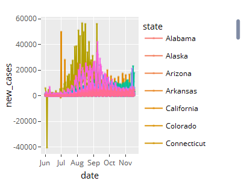

``` r
p1<-NULL # to clear from workspace

p2<-ggplot(cv_states, aes(x = date, y = new_deaths, color = state)) + geom_line() + geom_point(size = .5, alpha = 0.5)
ggplotly(p2)
```

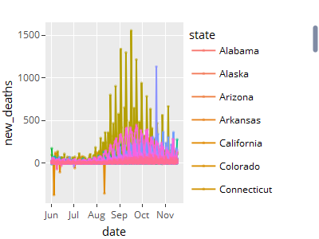

``` r
p2<-NULL # to clear from workspace

# set negative new case or death counts to 0
cv_states$new_cases[cv_states$new_cases<0] = 0
cv_states$new_deaths[cv_states$new_deaths<0] = 0

# Recalculate `cases` and `deaths` as cumulative sum of updated `new_cases` and `new_deaths`
for (i in 1:length(state_list)) {
  cv_subset = subset(cv_states, state == state_list[i])

  # add starting level for new cases and deaths
  cv_subset$cases = cv_subset$cases[1]
  cv_subset$deaths = cv_subset$deaths[1]

  ### FINISH CODE HERE
  for (j in 2:nrow(cv_subset)) {
    cv_subset$cases[j] = cv_subset$new_cases[j] + cv_subset$cases[j-1]
    cv_subset$deaths[j] = cv_subset$new_deaths[j] + cv_subset$deaths[j-1]
  }
  # include in main dataset
  cv_states$cases[cv_states$state==state_list[i]] = cv_subset$cases
  cv_states$deaths[cv_states$state==state_list[i]] = cv_subset$deaths
}

# Smooth new counts
cv_states$new_cases = zoo::rollmean(cv_states$new_cases, k=7, fill=NA, align='right') %>% round(digits = 0)
cv_states$new_deaths = zoo::rollmean(cv_states$new_deaths, k=7, fill=NA, align='right') %>% round(digits = 0)

# Inspect data again interactively
p2<-ggplot(cv_states, aes(x = date, y = new_deaths, color = state)) + geom_line() + geom_point(size = .5, alpha = 0.5)
ggplotly(p2)
```

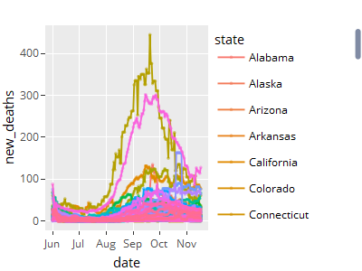

``` r
#p2=NULL
```

### 5. Add additional variables

-   Add population-normalized (by 100,000) variables for each variable
    type (rounded to 1 decimal place). Make sure the variables you
    calculate are in the correct format (`numeric`). You can use the
    following variable names:

    -   `per100k` = cases per 100,000 population
    -   `newper100k`= new cases per 100,000
    -   `deathsper100k` = deaths per 100,000
    -   `newdeathsper100k` = new deaths per 100,000

-   Add a “naive CFR” variable representing `deaths / cases` on each
    date for each state

-   Create a dataframe representing values on the most recent date,
    `cv_states_today`, as done in lecture

``` r
### FINISH CODE HERE
# add population normalized (by 100,000) counts for each variable
cv_states$per100k =  as.numeric(format(round(cv_states$cases/(cv_states$population/100000),1),nsmall=1))
cv_states$newper100k =  as.numeric(format(round(cv_states$new_cases/(cv_states$population/100000),1),nsmall=1))
cv_states$deathsper100k =  as.numeric(format(round(cv_states$deaths/(cv_states$population/100000),1),nsmall=1))
cv_states$newdeathsper100k =  as.numeric(format(round(cv_states$new_deaths/(cv_states$population/100000),1),nsmall=1))

# add a naive_CFR variable = deaths / cases
cv_states = cv_states %>% mutate(naive_CFR = round((deaths*100/cases),2))

# create a `cv_states_today` variable
cv_states_today = subset(cv_states, date==max(cv_states$date))
```

## II. Scatterplots

### 6. Explore scatterplots using `plot_ly()`

-   Create a scatterplot using `plot_ly()` representing `pop_density`
    vs. various variables (e.g. `cases`, `per100k`, `deaths`,
    `deathsper100k`) for each state on most recent date
    (`cv_states_today`)
    -   Color points by state and size points by state population
    -   Use hover to identify any outliers.
    -   Remove those outliers and replot.
-   Choose one plot. For this plot:
    -   Add hoverinfo specifying the state name, cases per 100k, and
        deaths per 100k, similarly to how we did this in the lecture
        notes
    -   Add layout information to title the chart and the axes
    -   Enable `hovermode = "compare"`

``` r
### FINISH CODE HERE
# filter out "District of Columbia"
cv_states_today_scatter <- cv_states_today %>% filter(state!="District of Columbia")

# pop_density vs. cases
cv_states_today %>% 
  plot_ly(x = ~pop_density, y = ~cases, 
          type = 'scatter', mode = 'markers', color = ~state,
          size = ~population, sizes = c(5, 70), marker = list(sizemode='diameter', opacity=0.5))
```

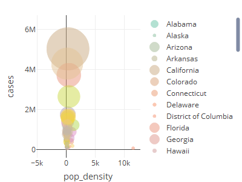

``` r
# filter out "District of Columbia"
cv_states_today_filter <- cv_states_today %>% filter(state!="District of Columbia")

# pop_density vs. cases after filtering
cv_states_today_scatter %>% 
  plot_ly(x = ~pop_density, y = ~cases, 
          type = 'scatter', mode = 'markers', color = ~state,
          size = ~population, sizes = c(5, 70), marker = list(sizemode='diameter', opacity=0.5))
```

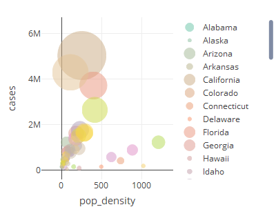

``` r
# pop_density vs. deathsper100k
cv_states_today_scatter %>% 
  plot_ly(x = ~pop_density, y = ~newdeathsper100k, 
          type = 'scatter', mode = 'markers', color = ~state,
          size = ~population, sizes = c(5, 70), marker = list(sizemode='diameter', opacity=0.5))
```

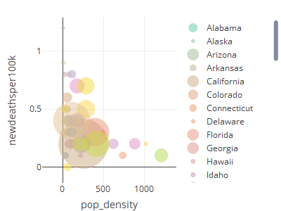

``` r
# Adding hoverinfo
cv_states_today_scatter %>% 
  plot_ly(x = ~pop_density, y = ~deathsper100k,
          type = 'scatter', mode = 'markers', color = ~state,
          size = ~population, sizes = c(5, 70), marker = list(sizemode='diameter', opacity=0.5),
          hoverinfo = 'text',
          text = ~paste( paste(state, ":", sep=""), paste(" Cases per 100k: ", per100k, sep="") , paste(" Deaths per 100k: ",
                        deathsper100k, sep=""), sep = "<br>")) %>%
  layout(title = "Population-normalized COVID-19 deaths (per 100k) vs. population density for US states",
                  yaxis = list(title = "Deaths per 100k"), xaxis = list(title = "Population Density"),
         hovermode = "compare")
```

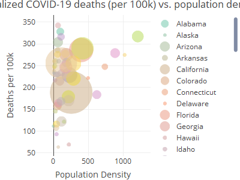

### 7. Explore scatterplot trend interactively using `ggplotly()` and `geom_smooth()`

-   For `pop_density` vs. `newdeathsper100k` create a chart with the
    same variables using `gglot_ly()`
-   Explore the pattern between *x* and *y* using `geom_smooth()`
    -   Explain what you see. Do you think `pop_density` is a correlate
        of `newdeathsper100k`?

``` r
### FINISH CODE HERE
p <- ggplot(cv_states_today_scatter, aes(x=pop_density, y=deathsper100k, size=population)) + geom_point() + geom_smooth()
ggplotly(p)
```

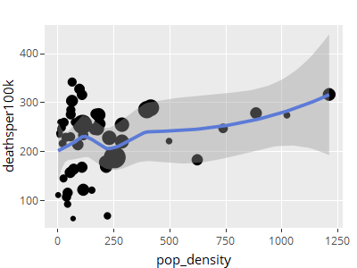

### 8. Multiple line chart

-   Create a line chart of the `naive_CFR` for all states over time
    using `plot_ly()`
    -   Use the zoom and pan tools to inspect the `naive_CFR` for the
        states that had an increase in September. How have they changed
        over time?
-   Create one more line chart, for Florida only, which shows
    `new_cases` and `new_deaths` together in one plot. Hint: use
    `add_layer()`
    -   Use hoverinfo to “eyeball” the approximate peak of deaths and
        peak of cases. What is the time delay between the peak of cases
        and the peak of deaths?

``` r
### FINISH CODE HERE
# Line chart for naive_CFR for all states over time using `plot_ly()`
plot_ly(cv_states, x = ~date, y = ~naive_CFR, color = ~state, type = "scatter", mode = "lines")
```

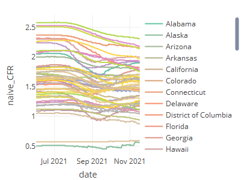

``` r
### FINISH CODE HERE
# Line chart for Florida showing new_cases and new_deaths together
cv_states %>% filter(state=="Texas") %>% plot_ly(x = ~date, y = ~new_cases, type = "scatter", mode = "lines") %>% add_lines(x = ~date, y = ~new_deaths, type = "scatter", mode = "lines")
```

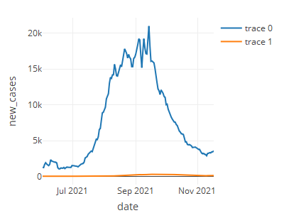

### 9. Heatmaps

Create a heatmap to visualize `new_cases` for each state on each date
greater than June 1st, 2021 - Start by mapping selected features in the
dataframe into a matrix using the **tidyr** package function
`pivot_wider()`, naming the rows and columns, as done in the lecture
notes - Use `plot_ly()` to create a heatmap out of this matrix. Which
states stand out? - Repeat with `newper100k` variable. Now which states
stand out? - Create a second heatmap in which the pattern of `new_cases`
for each state over time becomes more clear by filtering to only look at
dates every two weeks

``` r
### FINISH CODE HERE
# Map state, date, and new_cases to a matrix
library(tidyr)
cv_states_mat <- cv_states %>% select(state, date, new_cases) %>% filter(date>as.Date("2020-04-01"))
cv_states_mat2 <- as.data.frame(pivot_wider(cv_states_mat, names_from = state, values_from = new_cases))
rownames(cv_states_mat2) <- cv_states_mat2$date
cv_states_mat2$date <- NULL
cv_states_mat2 <- as.matrix(cv_states_mat2)
# Create a heatmap using plot_ly()
plot_ly(x=colnames(cv_states_mat2), y=rownames(cv_states_mat2),
             z=~cv_states_mat2,
             type="heatmap",
             showscale=T)
```

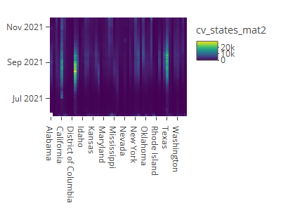

``` r
# Create a second heatmap after filtering to only include dates every other week
filter_dates <- seq(as.Date("2020-04-01"), as.Date("2020-10-01"), by="2 weeks")
cv_states_mat <- cv_states %>% select(state, date, new_cases) %>% filter(date %in% filter_dates)
cv_states_mat2 <- as.data.frame(pivot_wider(cv_states_mat, names_from = state, values_from = new_cases))
rownames(cv_states_mat2) <- cv_states_mat2$date
cv_states_mat2$date <- NULL
cv_states_mat2 <- as.matrix(cv_states_mat2)
# Create a heatmap using plot_ly()
plot_ly(x=colnames(cv_states_mat2), y=rownames(cv_states_mat2),
             z=~cv_states_mat2,
             type="heatmap",
             showscale=T)
```

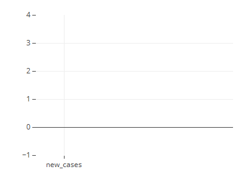

### 10. Map

-   Create a map to visualize the `naive_CFR` by state on October 15,
    2021
-   Compare with a map visualizing the `naive_CFR` by state on most
    recent date
-   Plot the two maps together using `subplot()`. Make sure the shading
    is for the same range of values (google is your friend for this)
-   Describe the difference in the pattern of the CFR.

``` r
# 
# ### For specified date
# 
# pick.date = "2021-10-15"
# 
# # Extract the data for each state by its abbreviation
# cv_CFR <- cv_states %>% filter(date=="2021-10-15") %>% select(state, abb, naive_CFR, cases, deaths) # select data
# cv_CFR$state_name <- cv_CFR$state
# cv_CFR$state <- cv_CFR$abb
# cv_CFR$abb <- NULL
# 
# # Create hover text
# cv_CFR$hover <- with(cv_CFR, paste(state_name, '<br>', "CFR: ", naive_CFR, '<br>', "Cases: ", cases, '<br>', "Deaths: ", deaths))
# 
# # Set up mapping details
# set_map_details <- list(
#   scope = 'usa',
#   projection = list(type = 'albers usa'),
#   showlakes = TRUE,
#   lakecolor = toRGB('white')
# )
# 
# # Make sure both maps are on the same color scale
# shadeLimit <- 125
# 
# # Create the map
# fig <- plot_geo(cv_per100, locationmode = 'USA-states') %>% 
#   add_trace(
#     z = ~newper100k, text = ~hover, locations = ~state,
#     color = ~newper100k, colors = 'Purples'
#   )
# fig <- fig %>% colorbar(title = paste0("Cases per 100k: ", pick.date), limits = c(0,shadeLimit))
# fig <- fig %>% layout(
#     title = paste('Cases per 100k by State as of ', pick.date, '<br>(Hover for value)'),
#     geo = set_map_details
#   )
# fig_pick.date <- fig
# 
# #############
# ### Map for today's date
# 
# # Extract the data for each state by its abbreviation
# cv_per100 <- cv_states_today %>%  select(state, abb, newper100k, cases, deaths) # select data
# cv_per100$state_name <- cv_per100$state
# cv_per100$state <- cv_per100$abb
# cv_per100$abb <- NULL
# 
# # Create hover text
# cv_per100$hover <- with(cv_per100, paste(state_name, '<br>', "Cases per 100k: ", newper100k, '<br>', "Cases: ", cases, '<br>', "Deaths: ", deaths))
# 
# # Set up mapping details
# set_map_details <- list(
#   scope = 'usa',
#   projection = list(type = 'albers usa'),
#   showlakes = TRUE,
#   lakecolor = toRGB('white')
# )
# 
# # Create the map
# fig <- plot_geo(cv_per100, locationmode = 'USA-states') %>% 
#   add_trace(
#     z = ~newper100k, text = ~hover, locations = ~state,
#     color = ~newper100k, colors = 'Purples'
#   )
# fig <- fig %>% colorbar(title = paste0("Cases per 100k: ", Sys.Date()), limits = c(0,shadeLimit))
# fig <- fig %>% layout(
#     title = paste('Cases per 100k by State as of', Sys.Date(), '<br>(Hover for value)'),
#     geo = set_map_details
#   )
# fig_Today <- fig
# 
# 
# ### Plot together 
# subplot(fig_pick.date, fig_Today, nrows = 2, margin = .05)
```
