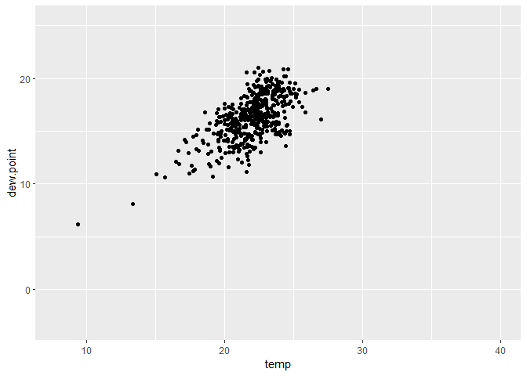

```{r setup, include=FALSE}
knitr::opts_chunk$set(echo = TRUE)
```

# Load Libraries
```{r message = FALSE, warning = FALSE}
library(tidyverse)
library(skimr)
library(lubridate)
library(leaflet)
library(gifski)
```


# 1. Read in Data
```{r, message = FALSE}
if (!file.exists("met_all.gz"))
  download.file(
    url = "https://raw.githubusercontent.com/USCbiostats/data-science-data/master/02_met/met_all.gz",
    destfile = "met_all.gz",
    method   = "libcurl",
    timeout  = 60
    )
met <- data.table::fread("met_all.gz")
```

# 2. Prepare the data
* Remove temperatures less than -17C
```{r}
# Remove temperatures less than -17
met2 <-
  met %>%
  filter(temp > -17)

# Remove missing/inaccurate data
met2 <- met2[elev == 9999.0, elev := NA]
```


* Make sure there are no missing data in the key variables coded as 9999, 999, etc
```{r}
# Descriptives
skim(met2)
```


* Generate a date variable using the functions as.Date() (hint: You will need the following to create a date paste(year, month, day, sep = "-")).
```{r}
met2$date <- as.Date(paste(
  met2$year, 
  met2$month, 
  met2$day, 
  sep = "-"))
```


* Using the data.table::week function, keep the observations of the first week of the month.
```{r}
# Filter to minimum week
met3 <- 
  met2 %>%
  filter(week(date) == min(week(met2$date)))
```


* Compute the mean by station of the variables temp, rh, wind.sp, vis.dist, dew.point, lat, lon, and elev.
```{r}
# Aggregate Data by USAFID
met3 <- 
  met3 %>%
  select(USAFID, temp, rh, wind.sp, vis.dist, dew.point, lat, lon, elev) %>%
  group_by(USAFID) %>%
  summarise_all(mean)
```


* Create a region variable for NW, SW, NE, SE based on lon = -98.00 and lat = 39.71 degrees
```{r}
# Create region
met4 <-
  met3 %>%
  mutate(region = case_when(
                              lon <= -98 & lat >= 39.71 ~ "Northwest"
                            , lon <= -98 & lat < 39.71 ~ "Southwest"
                            , lon > -98 & lat >= 39.71 ~ "Northeast"
                            , lon > -98 & lat < 39.71 ~ "Southeast"
                            )
         )
```


* Create a categorical variable for elevation as in the lecture slides
```{r}
# Create elevation
met5 <-
  met4 %>%
  mutate(elev_cat = case_when(elev > 252 ~ "high"
                          , TRUE ~ "low")
        )
```

# 3. Use geom_violin to examine the wind speed and dew point temperature by region
* You saw how to use geom_boxplot in class. Try using geom_violin instead (take a look at the help). (hint: You will need to set the x aesthetic to 1)
* Use facets
* Make sure to deal with NA category
* Describe what you observe in the graph
```{r}
met5 %>% 
  ggplot() + 
  geom_violin(mapping = aes(x = dew.point, y = wind.sp, color=region)) + 
  facet_wrap(~ region, nrow = 1)
```
> The NE has the widest range of wind speed. The SE seems to have the highest average dew point, but the least variability in wind speed. The NE and SW appear to both have the same average dew point with the SW varying more in wind speed.

# 4. Use geom_jitter with stat_smooth to examine the association between dew point temperature and wind speed by region
* Colour points by region
* Make sure to deal with NA category
* Fit a linear regression line by region
* Describe what you observe in the graph
```{r}
met5 %>% 
  ggplot() + 
  geom_jitter(mapping = aes(x = dew.point, y = wind.sp, color=region)) + 
  geom_smooth(mapping = aes(x = dew.point, y = wind.sp, linetype = region))
  facet_wrap(~ region, nrow = 1)
```
> When the dew point reaches around 10, the regions being to start varying from each other.

# 5. Use geom_bar to create barplots of the weather stations by elevation category coloured by region
* Bars by elevation category using position="dodge"
* Change colours from the default. Colour by region using scale_fill_brewer see this
* Create nice labels on axes and add a title
* Describe what you observe in the graph
* Make sure to deal with NA
```{r}
met5 %>%
  ggplot() + 
  geom_bar(mapping = aes(x = elev_cat, fill = region), position = "dodge") + 
  labs(x = "Elevation Categories", y = "N (count)", title = "Elevation by Region") +
  scale_fill_brewer(palette = "Pastel1")
```
> The NE appears to have the highest elevation when compared to other regions. The SE appears to have more low elevation areas when compared to the rest.


# 6. Use stat_summary to examine mean dew point and wind speed by region with standard deviation error bars
* Make sure to remove NA
* Use fun.data=“mean_sdl” in stat_summary
* Add another layer of stats_summary but change the geom to "errorbar" (see the help).
* Describe the graph and what you observe
* Dew point temperature is…
* Wind speed is…
```{r}
# Wind Speed
met5 %>%
  ggplot() + 
    stat_summary(mapping = aes(x = region, y = wind.sp),
    fun.windsp = "mean_sdl",
    geom = "errorbar"
    )

# Dew Point
met5 %>%
  ggplot() + 
    stat_summary(mapping = aes(x = region, y = dew.point),
    fun.windsp = "mean_sdl",
    geom = "errorbar"
    )
```
> Wind speed tends to have a higher variation versus dew point. The eastern regions have lower average wind speeds when compared to the western regions. The eastern regions have higher average dew points than the western regions,

# 7. Make a map showing the spatial trend in relative h in the US
* Make sure to remove NA
* Use leaflet()
* Make a colour palette with custom colours
* Use addMarkers to include the top 10 places in relative h (hint: this will be useful rank(-rh) <= 10)
* Add a legend
* Describe trend in RH across the US

```{r}
# Create rank for rh
rh_rank <-
  met5 %>%
  filter(rank(rh) >= 1 & rank(rh) <= 10)

# Generating a color palette
temp.pal <- colorNumeric(c('darkgreen','goldenrod','brown'), domain=rh_rank$rh)
temp.pal

tempmap <- leaflet(rh_rank) %>% 
  
  # The looks of the Map
  addProviderTiles('CartoDB.Positron') %>% 
  
  # Some circles
  addCircles(
    lat = ~lat, lng=~lon,
                                                  # HERE IS OUR PAL!
    label = ~paste0(round(temp,2), ' C'), color = ~ temp.pal(rh),
    opacity = 1, fillOpacity = 1, radius = 500
    ) %>%
  
  # And a pretty legend
  addLegend('bottomleft', pal=temp.pal, values=rh_rank$rh,
          title='Temperature, C', opacity=1) %>%
  
  # Top 10 places in relative h
  addMarkers(~lon, ~lat)

tempmap
```

# 8. Use a ggplot extension
* Pick and extension (except cowplot) from here and make a plot of your choice using the met data (or met_avg)
* Might want to try examples that come with the extension first (e.g. ggtech, gganimate, ggforce)

```{r message = FALSE, warning = FALSE, results = FALSE}
# Load library
library(gganimate)

p <- 
  ggplot(met5, aes(x = temp, y = dew.point)) + 
  geom_point() + 
  transition_states(region,
                    transition_length = 2,
                    state_length = 1)

animate(p, renderer = gifski_renderer())

anim_save("output.gif")
```



