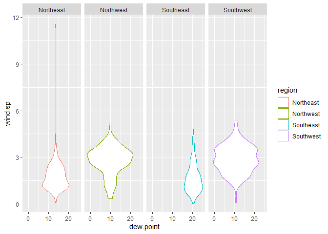
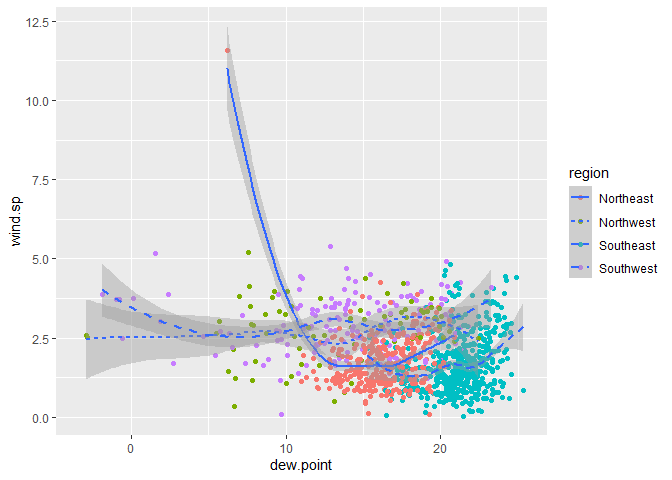
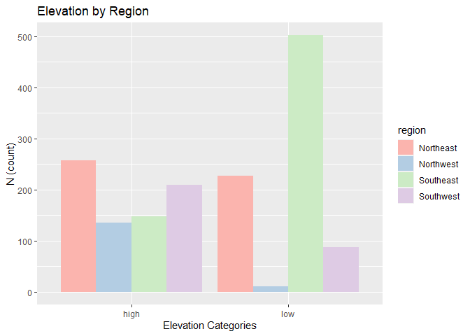
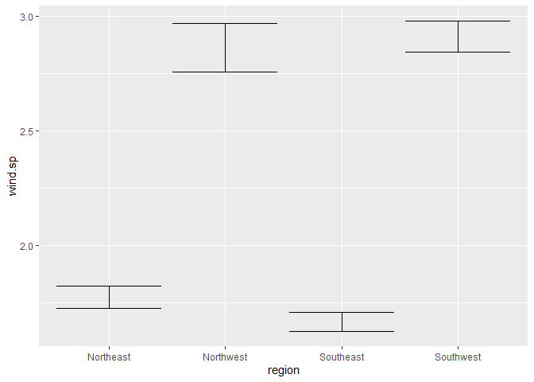
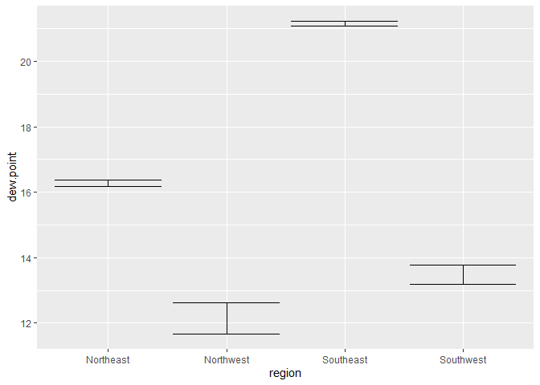
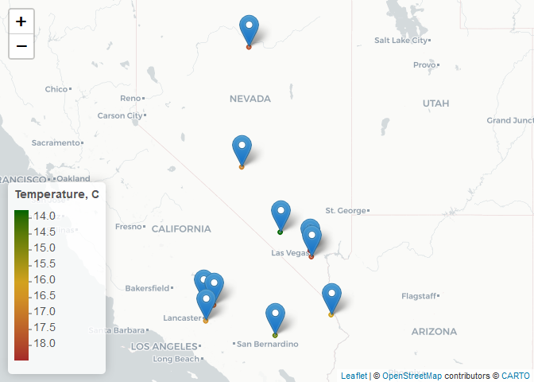

Lab 4 - Data Visualization
================
Gene Nguyen
9/17/2021

# Load Libraries

``` r
library(tidyverse)
library(skimr)
library(lubridate)
library(leaflet)
library(gifski)
```

# 1. Read in Data

``` r
if (!file.exists("met_all.gz"))
  download.file(
    url = "https://raw.githubusercontent.com/USCbiostats/data-science-data/master/02_met/met_all.gz",
    destfile = "met_all.gz",
    method   = "libcurl",
    timeout  = 60
    )
met <- data.table::fread("met_all.gz")
```

# 2. Prepare the data

-   Remove temperatures less than -17C

``` r
# Remove temperatures less than -17
met2 <-
  met %>%
  filter(temp > -17)

# Remove missing/inaccurate data
met2 <- met2[elev == 9999.0, elev := NA]
```

-   Make sure there are no missing data in the key variables coded as
    9999, 999, etc

``` r
# Descriptives
skim(met2)
```

|                                                  |         |
|:-------------------------------------------------|:--------|
| Name                                             | met2    |
| Number of rows                                   | 2317204 |
| Number of columns                                | 30      |
| Key                                              | NULL    |
| \_\_\_\_\_\_\_\_\_\_\_\_\_\_\_\_\_\_\_\_\_\_\_   |         |
| Column type frequency:                           |         |
| character                                        | 10      |
| numeric                                          | 20      |
| \_\_\_\_\_\_\_\_\_\_\_\_\_\_\_\_\_\_\_\_\_\_\_\_ |         |
| Group variables                                  | None    |

Data summary

**Variable type: character**

| skim\_variable    | n\_missing | complete\_rate | min | max | empty | n\_unique | whitespace |
|:------------------|-----------:|---------------:|----:|----:|------:|----------:|-----------:|
| wind.dir.qc       |          0 |              1 |   1 |   1 |     0 |         5 |          0 |
| wind.type.code    |          0 |              1 |   1 |   1 |     0 |         4 |          0 |
| wind.sp.qc        |          0 |              1 |   0 |   1 |     6 |        11 |          0 |
| ceiling.ht.method |          0 |              1 |   1 |   1 |     0 |         3 |          0 |
| sky.cond          |          0 |              1 |   1 |   1 |     0 |         2 |          0 |
| vis.dist.qc       |          0 |              1 |   1 |   1 |     0 |         7 |          0 |
| vis.var           |          0 |              1 |   1 |   1 |     0 |         3 |          0 |
| vis.var.qc        |          0 |              1 |   1 |   1 |     0 |         3 |          0 |
| temp.qc           |          0 |              1 |   1 |   1 |     0 |         8 |          0 |
| dew.point.qc      |          0 |              1 |   1 |   1 |     0 |         9 |          0 |

**Variable type: numeric**

| skim\_variable | n\_missing | complete\_rate |      mean |       sd |        p0 |       p25 |       p50 |       p75 |      p100 | hist  |
|:---------------|-----------:|---------------:|----------:|---------:|----------:|----------:|----------:|----------:|----------:|:------|
| USAFID         |          0 |           1.00 | 723094.72 |  2159.94 | 690150.00 | 720927.00 | 722720.00 | 725090.00 | 726813.00 | ▁▁▁▁▇ |
| WBAN           |          0 |           1.00 |  29495.92 | 33354.08 |    116.00 |   3705.00 |  13841.00 |  54768.00 |  94998.00 | ▇▁▂▁▂ |
| year           |          0 |           1.00 |   2019.00 |     0.00 |   2019.00 |   2019.00 |   2019.00 |   2019.00 |   2019.00 | ▁▁▇▁▁ |
| month          |          0 |           1.00 |      8.00 |     0.00 |      8.00 |      8.00 |      8.00 |      8.00 |      8.00 | ▁▁▇▁▁ |
| day            |          0 |           1.00 |     16.00 |     8.92 |      1.00 |      8.00 |     16.00 |     24.00 |     31.00 | ▇▇▇▇▇ |
| hour           |          0 |           1.00 |     11.46 |     6.87 |      0.00 |      6.00 |     11.00 |     17.00 |     23.00 | ▇▇▆▇▇ |
| min            |          0 |           1.00 |     39.23 |    17.20 |      0.00 |     20.00 |     48.00 |     55.00 |     59.00 | ▁▃▃▁▇ |
| lat            |          0 |           1.00 |     37.97 |     5.17 |     24.55 |     33.98 |     38.37 |     41.96 |     48.94 | ▁▆▇▇▃ |
| lon            |          0 |           1.00 |    -92.14 |    11.93 |   -124.29 |    -98.02 |    -91.74 |    -82.99 |    -68.31 | ▂▂▇▇▃ |
| elev           |        182 |           1.00 |    414.33 |   550.78 |    -13.00 |    101.00 |    252.00 |    400.00 |   4113.00 | ▇▁▁▁▁ |
| wind.dir       |     732170 |           0.68 |    184.98 |    92.30 |      3.00 |    120.00 |    180.00 |    260.00 |    360.00 | ▅▆▇▆▅ |
| wind.sp        |      31743 |           0.99 |      2.46 |     2.15 |      0.00 |      0.00 |      2.10 |      3.60 |     36.00 | ▇▁▁▁▁ |
| ceiling.ht     |      73437 |           0.97 |  16170.79 |  9280.07 |      0.00 |   3048.00 |  22000.00 |  22000.00 |  22000.00 | ▃▁▁▁▇ |
| ceiling.ht.qc  |          0 |           1.00 |      4.95 |     1.12 |      1.00 |      5.00 |      5.00 |      5.00 |      9.00 | ▁▁▇▁▁ |
| vis.dist       |      33666 |           0.99 |  14923.81 |  3870.72 |      0.00 |  16093.00 |  16093.00 |  16093.00 | 160000.00 | ▇▁▁▁▁ |
| temp           |          0 |           1.00 |     23.59 |     6.05 |     -3.00 |     19.60 |     23.50 |     27.80 |     56.00 | ▁▃▇▁▁ |
| dew.point      |       6287 |           1.00 |     17.02 |     6.21 |    -37.20 |     13.80 |     18.10 |     21.70 |     36.00 | ▁▁▁▇▃ |
| atm.press      |    1606783 |           0.31 |   1014.17 |     4.06 |    960.50 |   1011.80 |   1014.10 |   1016.40 |   1059.90 | ▁▁▇▁▁ |
| atm.press.qc   |          0 |           1.00 |      7.70 |     2.03 |      1.00 |      5.00 |      9.00 |      9.00 |      9.00 | ▁▁▃▁▇ |
| rh             |       6287 |           1.00 |     71.64 |    22.75 |      0.83 |     55.79 |     76.55 |     90.63 |    100.00 | ▁▂▃▅▇ |

-   Generate a date variable using the functions as.Date() (hint: You
    will need the following to create a date paste(year, month, day, sep
    = “-”)).

``` r
met2$date <- as.Date(paste(
  met2$year, 
  met2$month, 
  met2$day, 
  sep = "-"))
```

-   Using the data.table::week function, keep the observations of the
    first week of the month.

``` r
# Filter to minimum week
met3 <- 
  met2 %>%
  filter(week(date) == min(week(met2$date)))
```

-   Compute the mean by station of the variables temp, rh, wind.sp,
    vis.dist, dew.point, lat, lon, and elev.

``` r
# Aggregate Data by USAFID
met3 <- 
  met3 %>%
  select(USAFID, temp, rh, wind.sp, vis.dist, dew.point, lat, lon, elev) %>%
  group_by(USAFID) %>%
  summarise_all(mean)
```

-   Create a region variable for NW, SW, NE, SE based on lon = -98.00
    and lat = 39.71 degrees

``` r
# Create region
met4 <-
  met3 %>%
  mutate(region = case_when(
                              lon <= -98 & lat >= 39.71 ~ "Northwest"
                            , lon <= -98 & lat < 39.71 ~ "Southwest"
                            , lon > -98 & lat >= 39.71 ~ "Northeast"
                            , lon > -98 & lat < 39.71 ~ "Southeast"
                            )
         )
```

-   Create a categorical variable for elevation as in the lecture slides

``` r
# Create elevation
met5 <-
  met4 %>%
  mutate(elev_cat = case_when(elev > 252 ~ "high"
                          , TRUE ~ "low")
        )
```

# 3. Use geom\_violin to examine the wind speed and dew point temperature by region

-   You saw how to use geom\_boxplot in class. Try using geom\_violin
    instead (take a look at the help). (hint: You will need to set the x
    aesthetic to 1)
-   Use facets
-   Make sure to deal with NA category
-   Describe what you observe in the graph

``` r
met5 %>% 
  ggplot() + 
  geom_violin(mapping = aes(x = dew.point, y = wind.sp, color=region)) + 
  facet_wrap(~ region, nrow = 1)
```

    ## Warning: Removed 543 rows containing non-finite values (stat_ydensity).

<!-- --> &gt; The NE
has the widest range of wind speed. The SE seems to have the highest
average dew point, but the least variability in wind speed. The NE and
SW appear to both have the same average dew point with the SW varying
more in wind speed.

# 4. Use geom\_jitter with stat\_smooth to examine the association between dew point temperature and wind speed by region

-   Colour points by region
-   Make sure to deal with NA category
-   Fit a linear regression line by region
-   Describe what you observe in the graph

``` r
met5 %>% 
  ggplot() + 
  geom_jitter(mapping = aes(x = dew.point, y = wind.sp, color=region)) + 
  geom_smooth(mapping = aes(x = dew.point, y = wind.sp, linetype = region))
```

    ## `geom_smooth()` using method = 'loess' and formula 'y ~ x'

    ## Warning: Removed 543 rows containing non-finite values (stat_smooth).

    ## Warning: Removed 543 rows containing missing values (geom_point).

<!-- -->

``` r
  facet_wrap(~ region, nrow = 1)
```

    ## <ggproto object: Class FacetWrap, Facet, gg>
    ##     compute_layout: function
    ##     draw_back: function
    ##     draw_front: function
    ##     draw_labels: function
    ##     draw_panels: function
    ##     finish_data: function
    ##     init_scales: function
    ##     map_data: function
    ##     params: list
    ##     setup_data: function
    ##     setup_params: function
    ##     shrink: TRUE
    ##     train_scales: function
    ##     vars: function
    ##     super:  <ggproto object: Class FacetWrap, Facet, gg>

> When the dew point reaches around 10, the regions being to start
> varying from each other.

# 5. Use geom\_bar to create barplots of the weather stations by elevation category coloured by region

-   Bars by elevation category using position=“dodge”
-   Change colours from the default. Colour by region using
    scale\_fill\_brewer see this
-   Create nice labels on axes and add a title
-   Describe what you observe in the graph
-   Make sure to deal with NA

``` r
met5 %>%
  ggplot() + 
  geom_bar(mapping = aes(x = elev_cat, fill = region), position = "dodge") + 
  labs(x = "Elevation Categories", y = "N (count)", title = "Elevation by Region") +
  scale_fill_brewer(palette = "Pastel1")
```

<!-- --> &gt; The NE
appears to have the highest elevation when compared to other regions.
The SE appears to have more low elevation areas when compared to the
rest.

# 6. Use stat\_summary to examine mean dew point and wind speed by region with standard deviation error bars

-   Make sure to remove NA
-   Use fun.data=“mean\_sdl” in stat\_summary
-   Add another layer of stats\_summary but change the geom to
    “errorbar” (see the help).
-   Describe the graph and what you observe
-   Dew point temperature is…
-   Wind speed is…

``` r
# Wind Speed
met5 %>%
  ggplot() + 
    stat_summary(mapping = aes(x = region, y = wind.sp),
    fun.windsp = "mean_sdl",
    geom = "errorbar"
    )
```

    ## Warning: Ignoring unknown parameters: fun.windsp

    ## Warning: Removed 503 rows containing non-finite values (stat_summary).

    ## No summary function supplied, defaulting to `mean_se()`

<!-- -->

``` r
# Dew Point
met5 %>%
  ggplot() + 
    stat_summary(mapping = aes(x = region, y = dew.point),
    fun.windsp = "mean_sdl",
    geom = "errorbar"
    )
```

    ## Warning: Ignoring unknown parameters: fun.windsp

    ## Warning: Removed 63 rows containing non-finite values (stat_summary).

    ## No summary function supplied, defaulting to `mean_se()`

<!-- --> &gt; Wind
speed tends to have a higher variation versus dew point. The eastern
regions have lower average wind speeds when compared to the western
regions. The eastern regions have higher average dew points than the
western regions,

# 7. Make a map showing the spatial trend in relative h in the US

-   Make sure to remove NA
-   Use leaflet()
-   Make a colour palette with custom colours
-   Use addMarkers to include the top 10 places in relative h (hint:
    this will be useful rank(-rh) &lt;= 10)
-   Add a legend
-   Describe trend in RH across the US

``` r
# Create rank for rh
rh_rank <-
  met5 %>%
  filter(rank(rh) >= 1 & rank(rh) <= 10)

# Generating a color palette
temp.pal <- colorNumeric(c('darkgreen','goldenrod','brown'), domain=rh_rank$rh)
temp.pal
```

    ## function (x) 
    ## {
    ##     if (length(x) == 0 || all(is.na(x))) {
    ##         return(pf(x))
    ##     }
    ##     if (is.null(rng)) 
    ##         rng <- range(x, na.rm = TRUE)
    ##     rescaled <- scales::rescale(x, from = rng)
    ##     if (any(rescaled < 0 | rescaled > 1, na.rm = TRUE)) 
    ##         warning("Some values were outside the color scale and will be treated as NA")
    ##     if (reverse) {
    ##         rescaled <- 1 - rescaled
    ##     }
    ##     pf(rescaled)
    ## }
    ## <bytecode: 0x00000000092b42f8>
    ## <environment: 0x00000000092b2d18>
    ## attr(,"colorType")
    ## [1] "numeric"
    ## attr(,"colorArgs")
    ## attr(,"colorArgs")$na.color
    ## [1] "#808080"

``` r
tempmap <- leaflet(rh_rank) %>% 
  
  # The looks of the Map
  addProviderTiles('CartoDB.Positron') %>% 
  
  # Some circles
  addCircles(
    lat = ~lat, lng=~lon,
                                                  # HERE IS OUR PAL!
    label = ~paste0(round(temp,2), ' C'), color = ~ temp.pal(rh),
    opacity = 1, fillOpacity = 1, radius = 500
    ) %>%
  
  # And a pretty legend
  addLegend('bottomleft', pal=temp.pal, values=rh_rank$rh,
          title='Temperature, C', opacity=1) %>%
  
  # Top 10 places in relative h
  addMarkers(~lon, ~lat)

tempmap
```

<!-- -->

# 8. Use a ggplot extension

-   Pick and extension (except cowplot) from here and make a plot of
    your choice using the met data (or met\_avg)
-   Might want to try examples that come with the extension first
    (e.g. ggtech, gganimate, ggforce)

``` r
# Load library
library(gganimate)

p <- 
  ggplot(met5, aes(x = temp, y = dew.point)) + 
  geom_point() + 
  transition_states(region,
                    transition_length = 2,
                    state_length = 1)

animate(p, renderer = gifski_renderer())

anim_save("output.gif")
```


