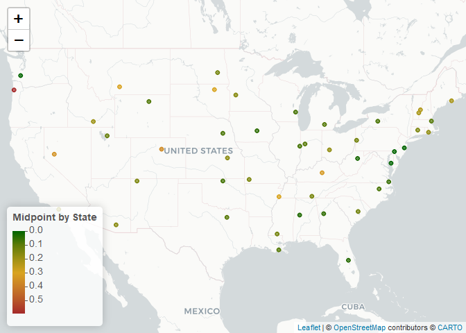

Lab 5 - Data Wrangling
================
Eugene Nguyen
9/24/2021

### Load Libraries

``` r
library(tidyverse)
library(data.table)
library(leaflet)
```

### Load Station Data

``` r
# Download the data
stations <- fread("ftp://ftp.ncdc.noaa.gov/pub/data/noaa/isd-history.csv")
stations[, USAF := as.integer(USAF)]
```

    ## Warning in eval(jsub, SDenv, parent.frame()): NAs introduced by coercion

``` r
# Dealing with NAs and 999999
stations[, USAF   := fifelse(USAF == 999999, NA_integer_, USAF)]
stations[, CTRY   := fifelse(CTRY == "", NA_character_, CTRY)]
stations[, STATE  := fifelse(STATE == "", NA_character_, STATE)]

# Selecting the three relevant columns, and keeping unique records
stations <- unique(stations[, list(USAF, CTRY, STATE)])

# Dropping NAs
stations <- stations[!is.na(USAF)]

# Removing duplicates
stations[, n := 1:.N, by = .(USAF)]
stations <- stations[n == 1,][, n := NULL]
```

### Load Met Data

``` r
if (!file.exists("met_all.gz"))
  download.file(
    url = "https://raw.githubusercontent.com/USCbiostats/data-science-data/master/02_met/met_all.gz",
    destfile = "met_all.gz",
    method   = "libcurl",
    timeout  = 60
    )
met <- data.table::fread("met_all.gz")
```

### Merge Station & Met

``` r
df <- merge(
  # Data
  x     = met,      
  y     = stations, 
  # List of variables to match
  by.x  = "USAFID",
  by.y  = "USAF", 
  # Which obs to keep?
  all.x = TRUE,      
  all.y = FALSE
  )
```

# Question 1: Representative station for the US

What is the median station in terms of temperature, wind speed, and
atmospheric pressure? Look for the three weather stations that best
represent continental US using the quantile() function. Do these three
coincide?

Knit the document, commit your changes, and Save it on GitHub. Don’t
forget to add README.md to the tree, the first time you render it.

``` r
# Average Station for temperature, wind speed, and atmospheric pressure
# Tidyverse Method
# station_avg <- df %>%
#   group_by(USAFID) %>%
#   summarise(temp_avg = mean(temp, na.rm = TRUE)
#             , wind.speed_avg = mean(wind.sp, na.rm = TRUE)
#             , atm.press_avg = mean(atm.press, na.rm = TRUE)
#             )

# data.table method
# Average Station for temperature, wind speed, and atmospheric pressure
stations_avg <- df[,.(
  temp = mean(temp, na.rm = TRUE),
  wind.sp = mean(wind.sp, na.rm = TRUE),
  atm.press = mean(atm.press, na.rm = TRUE)
), by = USAFID]
```

``` r
# Identify quantiles per variable
medians <- stations_avg[,.(
  temp_50 = quantile(temp, probs = .5, na.rm = TRUE),
  wind.sp_50 = quantile(wind.sp, probs = .5, na.rm = TRUE),
  atm_press_50 = quantile(atm.press, probs = .5, na.rm = TRUE)
)]

medians
```

    ##     temp_50 wind.sp_50 atm_press_50
    ## 1: 23.68406   2.461838     1014.691

``` r
# Find stations closest to these values
# Using which.min() function 
# Median temp
stations_avg[, temp_dist := abs(temp - medians$temp_50)]
median_temp_station <- stations_avg[order(temp_dist)[1]]
median_temp_station
```

    ##    USAFID     temp  wind.sp atm.press   temp_dist
    ## 1: 720458 23.68173 1.209682       NaN 0.002328907

``` r
# Median wind speed
stations_avg[, wind.sp_dist := abs(wind.sp - medians$wind.sp_50)]
median_windsp_station <- stations_avg[order(wind.sp_dist)[1]]
median_windsp_station
```

    ##    USAFID     temp  wind.sp atm.press temp_dist wind.sp_dist
    ## 1: 720929 17.43278 2.461838       NaN  6.251284            0

``` r
# Median atm press
stations_avg[, atm.press_dist := abs(atm.press - medians$atm_press_50)]
median_atmpress_station <- stations_avg[order(atm.press_dist)[1]]
median_atmpress_station
```

    ##    USAFID     temp  wind.sp atm.press temp_dist wind.sp_dist atm.press_dist
    ## 1: 722238 26.13978 1.472656  1014.691  2.455719    0.9891817   0.0005376377

The station that is closest to the median temperature is 720458. The
station that is closest to the median wind speed is 720929. The station
that is closest to the median wind speed is 722238.

# Question 2: Representative station per state

Just like the previous question, you are asked to identify what is the
most representative, the median, station per state. This time, instead
of looking at one variable at a time, look at the euclidean distance. If
multiple stations show in the median, select the one located at the
lowest latitude.

Knit the doc and save it on GitHub.

``` r
# Merge state information
stations_avg2 <- merge(x = stations_avg, y = stations, by.x = 'USAFID', by.y = "USAF", all.x = TRUE, all.y = FALSE)
```

``` r
# Get the medians by state for temperature, wind speed, and atm press
stations_avg2[, temp_50 := quantile(temp, probs = .5, na.rm = TRUE), by = STATE]
stations_avg2[, windsp_50 := quantile(wind.sp, probs = .5, na.rm = TRUE), by = STATE]
stations_avg2[, atmpress_50 := quantile(atm.press, probs = .5, na.rm = TRUE), by = STATE]
```

``` r
# Calculate Euclidean Distance
stations_avg2[, eudist := sqrt(
  (temp - temp_50)^2 + (wind.sp - windsp_50)^2
                              )]
```

``` r
# Lowest euclidean distance by State
stations_avg2[ , .SD[which.min(eudist)], by = STATE]
```

    ##     STATE USAFID     temp  wind.sp atm.press temp_dist wind.sp_dist
    ##  1:    CA 722970 22.76040 2.325982  1012.710 0.9236572   0.13585606
    ##  2:    TX 722598 29.81293 3.521417       NaN 6.1288732   1.05957887
    ##  3:    MI 725395 20.44096 2.357275  1015.245 3.2431039   0.10456335
    ##  4:    SC 723107 25.95831 1.599275       NaN 2.2742552   0.86256290
    ##  5:    IL 722076 22.34403 2.244115       NaN 1.3400341   0.21772293
    ##  6:    MO 720479 24.14775 2.508153       NaN 0.4636885   0.04631522
    ##  7:    AR 722054 26.58944 1.707136  1014.127 2.9053841   0.75470197
    ##  8:    OR 720202 17.16329 1.828437       NaN 6.5207664   0.63340128
    ##  9:    WA 720254 19.24684 1.268571       NaN 4.4372238   1.19326651
    ## 10:    GA 722197 26.70404 1.544133  1015.574 3.0199790   0.91770446
    ## 11:    MN 726553 19.67552 2.393582       NaN 4.0085430   0.06825575
    ## 12:    AL 722286 26.35793 1.675828  1014.909 2.6738730   0.78600982
    ## 13:    IN 724386 22.32575 2.243013  1014.797 1.3583049   0.21882484
    ## 14:    NC 720864 24.82394 1.612864       NaN 1.1398816   0.84897423
    ## 15:    VA 724006 24.31662 1.650539       NaN 0.6325625   0.81129885
    ## 16:    IA 725464 21.37948 2.679227       NaN 2.3045767   0.21738934
    ## 17:    PA 725204 21.87141 1.825605       NaN 1.8126473   0.63623280
    ## 18:    NE 725565 21.86100 3.098367  1015.068 1.8230630   0.63652902
    ## 19:    ID 725867 20.81272 2.702517  1012.802 2.8713440   0.24067862
    ## 20:    WI 726413 18.94233 2.028610       NaN 4.7417341   0.43322758
    ## 21:    WV 720328 21.94820 1.617823       NaN 1.7358610   0.84401481
    ## 22:    MD 722218 24.89883 1.883499       NaN 1.2147717   0.57833929
    ## 23:    AZ 722745 30.31538 3.307632  1010.144 6.6313167   0.84579394
    ## 24:    OK 720625 27.06188 3.865717       NaN 3.3778197   1.40387893
    ## 25:    WY 726654 19.85844 3.775443  1014.107 3.8256192   1.31360480
    ## 26:    LA 722041 27.84758 1.476664       NaN 4.1635250   0.98517427
    ## 27:    KY 720448 23.52994 1.604905       NaN 0.1541178   0.85693245
    ## 28:    FL 722011 27.56952 2.674074  1016.063 3.8854636   0.21223614
    ## 29:    CO 724699 21.94228 2.844072       NaN 1.7417815   0.38223383
    ## 30:    OH 724295 21.97211 2.803524  1015.742 1.7119534   0.34168629
    ## 31:    NJ 724090 23.47238 2.148606  1015.095 0.2116829   0.31323188
    ## 32:    NM 723658 24.94447 3.569281  1013.917 1.2604141   1.10744311
    ## 33:    KS 724550 24.14958 3.449278  1013.315 0.4655163   0.98743989
    ## 34:    ND 720911 18.34248 3.940128       NaN 5.3415810   1.47829033
    ## 35:    VT 726115 18.60548 1.101301  1014.985 5.0785811   1.36053682
    ## 36:    MS 722358 26.54093 1.747426  1014.722 2.8568706   0.71441147
    ## 37:    CT 725087 22.57539 2.126514  1014.534 1.1086682   0.33532437
    ## 38:    NV 724885 24.78430 2.600266  1013.855 1.1002416   0.13842767
    ## 39:    UT 725750 24.23571 3.040962  1011.521 0.5516551   0.57912435
    ## 40:    SD 726590 19.95928 3.550722  1014.284 3.7247800   1.08888409
    ## 41:    TN 720974 24.71645 1.483411       NaN 1.0323860   0.97842694
    ## 42:    NY 724988 20.44142 2.394383  1016.233 3.2426385   0.06745468
    ## 43:    RI 725079 22.27697 2.583469  1014.620 1.4070879   0.12163090
    ## 44:    MA 725088 21.20391 2.773018  1013.718 2.4801457   0.31117957
    ## 45:    DE 724180 24.56026 2.752929  1015.046 0.8761984   0.29109156
    ## 46:    NH 726116 19.23920 1.465766  1013.840 4.4448592   0.99607217
    ## 47:    ME 726077 18.49969 2.337241  1014.475 5.1843701   0.12459727
    ## 48:    MT 726798 19.47014 4.445783  1014.072 4.2139153   1.98394520
    ##     STATE USAFID     temp  wind.sp atm.press temp_dist wind.sp_dist
    ##     atm.press_dist CTRY  temp_50 windsp_50 atmpress_50     eudist
    ##  1:     1.98090662   US 22.66268  2.565445    1012.557 0.25863745
    ##  2:            NaN   US 29.75188  3.413737    1012.460 0.12378522
    ##  3:     0.55414742   US 20.51970  2.273423    1014.927 0.11503023
    ##  4:            NaN   US 25.80545  1.696119    1015.281 0.18095742
    ##  5:            NaN   US 22.43194  2.237622    1014.760 0.08815689
    ##  6:            NaN   US 23.95109  2.453547    1014.522 0.20409808
    ##  7:     0.56429267   US 26.24296  1.938625    1014.591 0.41669854
    ##  8:            NaN   US 17.98061  2.011436    1015.269 0.83755473
    ##  9:            NaN   US 19.24684  1.268571          NA 0.00000000
    ## 10:     0.88250764   US 26.70404  1.495596    1015.208 0.04853710
    ## 11:            NaN   US 19.63017  2.617071    1015.042 0.22804190
    ## 12:     0.21799151   US 26.33664  1.662132    1014.959 0.02531829
    ## 13:     0.10602154   US 22.25059  2.344333    1015.063 0.12615513
    ## 14:            NaN   US 24.72953  1.627306    1015.420 0.09550599
    ## 15:            NaN   US 24.37799  1.653032    1015.158 0.06141630
    ## 16:            NaN   US 21.33461  2.680875    1014.964 0.04490047
    ## 17:            NaN   US 21.69177  1.784167    1015.435 0.18435880
    ## 18:     0.37686248   US 21.87354  3.192539    1014.332 0.09500413
    ## 19:     1.88911023   US 20.56798  2.568944    1012.855 0.27881642
    ## 20:            NaN   US 18.85524  2.053283    1014.893 0.09051251
    ## 21:            NaN   US 21.94446  1.633487    1015.762 0.01610412
    ## 22:            NaN   US 24.89883  1.883499    1014.824 0.00000000
    ## 23:     4.54708887   US 30.32372  3.074359    1010.144 0.23342190
    ## 24:            NaN   US 27.14427  3.852697    1012.567 0.08341749
    ## 25:     0.58404600   US 19.80699  3.873392    1013.157 0.11063960
    ## 26:            NaN   US 27.87430  1.592840    1014.593 0.11920878
    ## 27:            NaN   US 23.88844  1.895486    1015.245 0.46147583
    ## 28:     1.37200241   US 27.57325  2.705069    1015.335 0.03121757
    ## 29:            NaN   US 21.49638  3.098777    1013.334 0.51351277
    ## 30:     1.05128416   US 22.02062  2.554397    1015.351 0.25380753
    ## 31:     0.40339033   US 23.47238  2.148606    1014.825 0.00000000
    ## 32:     0.77461602   US 24.94447  3.776083    1012.525 0.20680190
    ## 33:     1.37635327   US 24.21220  3.680613    1013.389 0.23966295
    ## 34:            NaN   US 18.52849  3.956459          NA 0.18672684
    ## 35:     0.29379796   US 18.61379  1.408247    1014.792 0.30705883
    ## 36:     0.03113360   US 26.69258  1.636392    1014.836 0.18795706
    ## 37:     0.15754612   US 22.36880  2.101801    1014.810 0.20806041
    ## 38:     0.83646713   US 24.56293  3.035050    1012.204 0.48789368
    ## 39:     3.17006719   US 24.35182  3.145427    1011.972 0.15618171
    ## 40:     0.40762293   US 20.35662  3.665638    1014.398 0.41362317
    ## 41:            NaN   US 24.88657  1.576035    1015.144 0.19370133
    ## 42:     1.54200536   US 20.40674  2.304075    1014.887 0.09673718
    ## 43:     0.07139021   US 22.53551  2.583469    1014.728 0.25853660
    ## 44:     0.97304128   US 21.30662  2.710944    1014.751 0.12000936
    ## 45:     0.35441624   US 24.56026  2.752929    1015.046 0.00000000
    ## 46:     0.85153342   US 19.55054  1.563826    1014.689 0.32641573
    ## 47:     0.21594166   US 18.79016  2.237210    1014.399 0.30721662
    ## 48:     0.61954666   US 19.15492  4.151737    1014.185 0.43107915
    ##     atm.press_dist CTRY  temp_50 windsp_50 atmpress_50     eudist

The station with the lowest euclidean distance between temperature and
wind speed is 722238.

# Question 3: In the middle?

For each state, identify what is the station that is closest to the
mid-point of the state. Combining these with the stations you identified
in the previous question, use leaflet() to visualize all \~100 points in
the same figure, applying different colors for those identified in this
question.

Knit the doc and save it on GitHub.

``` r
# Calculate midpoint by State
stations_avg2[, midpoint := sqrt(
  ((temp - temp_50)^2 + (wind.sp - windsp_50)^2) / 2
                              )]
```

``` r
# Lowest midpoint by State
map <- stations_avg2[ , .SD[which.min(midpoint)], by = STATE]
```

``` r
# Create table to map lat/lon
hashtable <- df %>%
  select(USAFID, lat, lon)

hashtable <- distinct(hashtable, USAFID, .keep_all = TRUE)
```

``` r
# Merge lat/lon data
# Merge state information
map2 <- merge(x = map, y = hashtable, by.x = 'USAFID', by.y = "USAFID", all.x = TRUE, all.y = FALSE)
```

``` r
# Create leaflet map
mp.pal <- colorNumeric(c('darkgreen','goldenrod','brown'), domain=map2$midpoint)

# Leadlet map
tempmap <- leaflet(map2) %>% 
  # The looks of the Map
  addProviderTiles('CartoDB.Positron') %>% 
  # Some circles
  addCircles(
    lat = ~lat, lng=~lon,
                                                  # HERE IS OUR PAL!
    label = ~paste0(round(temp,2), ' C'), color = ~ mp.pal(midpoint),
    opacity = 1, fillOpacity = 1, radius = 500
    ) %>%
  # And a pretty legend
  addLegend('bottomleft', pal=mp.pal, values=map2$midpoint,
          title='Midpoint by State', opacity=1)

tempmap
```

<!-- -->

# Question 4: Means of means

Using the quantile() function, generate a summary table that shows the
number of states included, average temperature, wind-speed, and
atmospheric pressure by the variable “average temperature level,” which
you’ll need to create.

Start by computing the states’ average temperature. Use that measurement
to classify them according to the following criteria:

low: temp &lt; 20 Mid: temp &gt;= 20 and temp &lt; 25 High: temp &gt;=
25

``` r
# Create
df[, state_temp := mean(temp, na.rm = TRUE), by = STATE]
df[, temp_cat := fifelse(
  state_temp < 20, "low-temp",
  fifelse(state_temp < 25, "mid-temp", "high-temp")
  )]
```

Once you are done with that, you can compute the following:

Number of entries (records), Number of NA entries, Number of stations,
Number of states included, and Mean temperature, wind-speed, and
atmospheric pressure. All by the levels described before.

``` r
# Summary table
df[, .(
  N_entries = .N,
  N_stations = length(unique(USAFID)),
  N_missing = sum(is.na(.SD)),
  N_states = length(unique(STATE)),
  mean_temperature = mean(temp, na.rm = TRUE),
  mean_windspeed = mean(wind.sp, na.rm = TRUE),
  mean_atmpress = mean(atm.press, na.rm = TRUE)
), by = temp_cat]
```

    ##     temp_cat N_entries N_stations N_missing N_states mean_temperature
    ## 1:  mid-temp   1135423        781   1361521       25         22.39909
    ## 2: high-temp    811126        555   1015145       12         27.75066
    ## 3:  low-temp    430794        259    549625       11         18.96446
    ##    mean_windspeed mean_atmpress
    ## 1:       2.352712      1014.383
    ## 2:       2.514644      1013.738
    ## 3:       2.637410      1014.366
