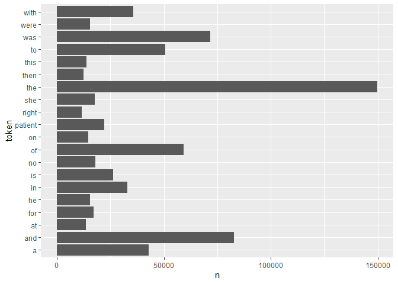
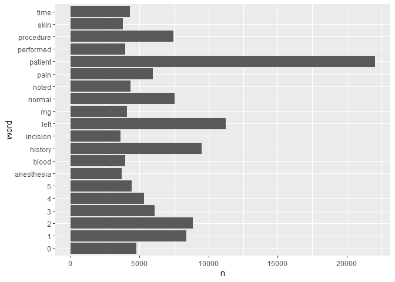
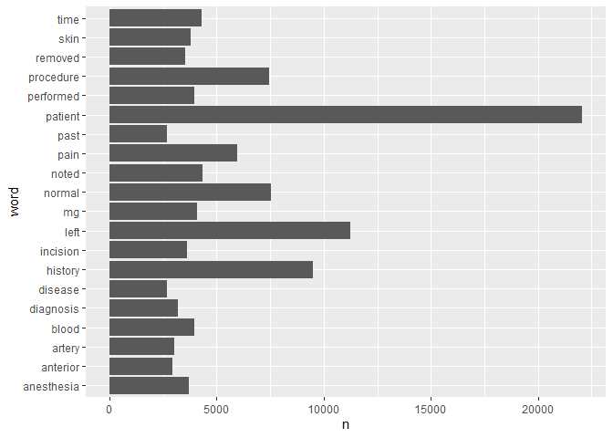
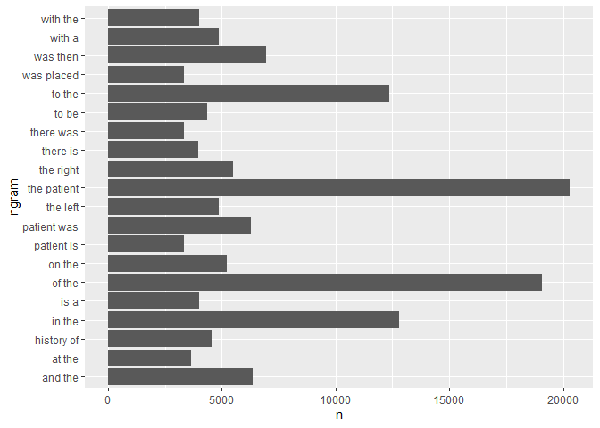
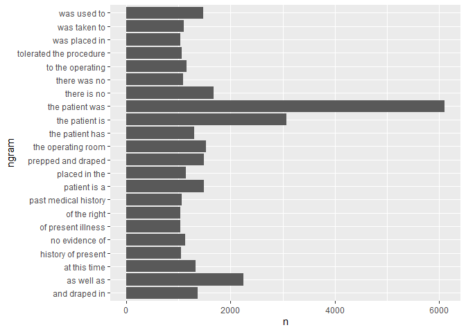

Lab 6 - Text Mining
================
Eugene Nguyen
10/5/2021

``` r
# Load Libraries
library(tidyverse)
library(tidytext)
library(tibble)
```

## Download The Data

``` r
fn <- "mtsamples.csv"
if (!file.exists(fn))
  download.file("https://raw.githubusercontent.com/USCbiostats/data-science-data/master/00_mtsamples/mtsamples.csv", destfile = fn)

mtsamples <- read.csv(fn)
mtsamples <- as.tibble(mtsamples)
```

    ## Warning: `as.tibble()` was deprecated in tibble 2.0.0.
    ## Please use `as_tibble()` instead.
    ## The signature and semantics have changed, see `?as_tibble`.

Take a look at the dataset

``` r
head(mtsamples)
```

    ## # A tibble: 6 x 6
    ##       X description    medical_specialty sample_name  transcription   keywords  
    ##   <int> <chr>          <chr>             <chr>        <chr>           <chr>     
    ## 1     0 " A 23-year-o~ " Allergy / Immu~ " Allergic ~ "SUBJECTIVE:, ~ "allergy ~
    ## 2     1 " Consult for~ " Bariatrics"     " Laparosco~ "PAST MEDICAL ~ "bariatri~
    ## 3     2 " Consult for~ " Bariatrics"     " Laparosco~ "HISTORY OF PR~ "bariatri~
    ## 4     3 " 2-D M-Mode.~ " Cardiovascular~ " 2-D Echoc~ "2-D M-MODE: ,~ "cardiova~
    ## 5     4 " 2-D Echocar~ " Cardiovascular~ " 2-D Echoc~ "1.  The left ~ "cardiova~
    ## 6     5 " Morbid obes~ " Bariatrics"     " Laparosco~ "PREOPERATIVE ~ "bariatri~

## Question 1: What specialties do we have?

We can use count() from dplyr to figure out how many different
catagories do we have? Are these catagories related? overlapping? evenly
distributed?

``` r
specialties <- 
  mtsamples %>%
  count(medical_specialty) %>%
  arrange(desc(n)) %>%
  top_n(n, 15) %>%
  knitr::kable()
```

    ## Warning in if (n > 0) {: the condition has length > 1 and only the first element
    ## will be used

``` r
specialties
```

| medical\_specialty            |    n |
|:------------------------------|-----:|
| Surgery                       | 1103 |
| Consult - History and Phy.    |  516 |
| Cardiovascular / Pulmonary    |  372 |
| Orthopedic                    |  355 |
| Radiology                     |  273 |
| General Medicine              |  259 |
| Gastroenterology              |  230 |
| Neurology                     |  223 |
| SOAP / Chart / Progress Notes |  166 |
| Obstetrics / Gynecology       |  160 |
| Urology                       |  158 |
| Discharge Summary             |  108 |
| ENT - Otolaryngology          |   98 |
| Neurosurgery                  |   94 |
| Hematology - Oncology         |   90 |
| Ophthalmology                 |   83 |
| Nephrology                    |   81 |
| Emergency Room Reports        |   75 |
| Pediatrics - Neonatal         |   70 |
| Pain Management               |   62 |
| Psychiatry / Psychology       |   53 |
| Office Notes                  |   51 |
| Podiatry                      |   47 |
| Dermatology                   |   29 |
| Cosmetic / Plastic Surgery    |   27 |
| Dentistry                     |   27 |
| Letters                       |   23 |
| Physical Medicine - Rehab     |   21 |
| Sleep Medicine                |   20 |
| Endocrinology                 |   19 |
| Bariatrics                    |   18 |
| IME-QME-Work Comp etc.        |   16 |
| Chiropractic                  |   14 |
| Diets and Nutritions          |   10 |
| Rheumatology                  |   10 |
| Speech - Language             |    9 |
| Autopsy                       |    8 |
| Lab Medicine - Pathology      |    8 |
| Allergy / Immunology          |    7 |
| Hospice - Palliative Care     |    6 |

There are specialties.

Let’s examine the distribution:

``` r
# Histogram for Medical Speciality
ggplot(mtsamples, aes(x = medical_specialty)) +
  geom_histogram(stat = "count") +
  coord_flip()
```

    ## Warning: Ignoring unknown parameters: binwidth, bins, pad

<!-- --> These
categories are not evenly distributed.

## Question 2

Tokenize the the words in the transcription column Count the number of
times each token appears Visualize the top 20 most frequent words
Explain what we see from this result. Does it makes sense? What insights
(if any) do we get?

``` r
# Tokenize the Transcription Column
transcription_20 <- 
  mtsamples %>%
  unnest_tokens(token, transcription) %>%
  count(token, sort = TRUE) %>%
  top_n(20, n)

transcription_20 %>%
  knitr::kable()
```

| token   |      n |
|:--------|-------:|
| the     | 149888 |
| and     |  82779 |
| was     |  71765 |
| of      |  59205 |
| to      |  50632 |
| a       |  42810 |
| with    |  35815 |
| in      |  32807 |
| is      |  26378 |
| patient |  22065 |
| no      |  17874 |
| she     |  17593 |
| for     |  17049 |
| he      |  15542 |
| were    |  15535 |
| on      |  14694 |
| this    |  13949 |
| at      |  13492 |
| then    |  12430 |
| right   |  11587 |

``` r
# Visualize the top 20
ggplot(transcription_20, aes(x = token, y = n)) +
  geom_bar(stat = "identity") +
  coord_flip()
```

<!-- --> There are many
unnecessary words in the histogram. These are also known as “stop
words”. There are available functions to remove them.

## Question 3

Redo visualization but remove stopwords before Bonus points if you
remove numbers as well What do we see know that we have removed stop
words? Does it give us a better idea of what the text is about?

``` r
# Remove Stop Words
transcription_20_sw <- 
  mtsamples %>%
  unnest_tokens(output = word, input = transcription) %>%
  count(word, sort = TRUE) %>%
  anti_join(stop_words, by = "word") %>%
  top_n(20)
```

    ## Selecting by n

``` r
transcription_20_sw %>%
  knitr::kable()
```

| word       |     n |
|:-----------|------:|
| patient    | 22065 |
| left       | 11258 |
| history    |  9509 |
| 2          |  8864 |
| 1          |  8396 |
| normal     |  7526 |
| procedure  |  7463 |
| 3          |  6093 |
| pain       |  5976 |
| 4          |  5318 |
| 0          |  4765 |
| 5          |  4427 |
| noted      |  4348 |
| time       |  4287 |
| mg         |  4087 |
| blood      |  3956 |
| performed  |  3953 |
| skin       |  3798 |
| anesthesia |  3707 |
| incision   |  3601 |

``` r
# Visualize the top 20 without the stop words
ggplot(transcription_20_sw, aes(x = word, y = n)) +
  geom_bar(stat = "identity") +
  coord_flip()
```

<!-- --> The graph looks
a lot better, but there are numbers that we should remove.

``` r
# Remove stop Words AND numbers
transcription_20_sw2 <- 
  mtsamples %>%
  unnest_tokens(output = word, input = transcription) %>%
  count(word, sort = TRUE) %>%
  anti_join(stop_words, by = "word") %>%
  filter(!grepl(pattern = "^[0-9]+$", x = word)) %>%
  top_n(20)
```

    ## Selecting by n

``` r
transcription_20_sw2 %>%
  knitr::kable()
```

| word       |     n |
|:-----------|------:|
| patient    | 22065 |
| left       | 11258 |
| history    |  9509 |
| normal     |  7526 |
| procedure  |  7463 |
| pain       |  5976 |
| noted      |  4348 |
| time       |  4287 |
| mg         |  4087 |
| blood      |  3956 |
| performed  |  3953 |
| skin       |  3798 |
| anesthesia |  3707 |
| incision   |  3601 |
| removed    |  3532 |
| diagnosis  |  3212 |
| artery     |  3027 |
| anterior   |  2932 |
| disease    |  2682 |
| past       |  2674 |

``` r
# Visualize the top 20 without the stop words AND numbers
ggplot(transcription_20_sw2, aes(x = word, y = n)) +
  geom_bar(stat = "identity") +
  coord_flip()
```

<!-- -->

## Question 4

repeat question 2, but this time tokenize into bi-grams. how does the
result change if you look at tri-grams?

``` r
# Tokenize the Transcription Column into bi-grams/tri-grams
# bi-gram
transcription_bg <- 
  mtsamples %>%
  unnest_ngrams(ngram, transcription, n = 2) %>%
  count(ngram, sort = TRUE) %>%
  top_n(20, n)

# tri-gram
transcription_tg <- 
  mtsamples %>%
  unnest_ngrams(ngram, transcription, n = 3) %>%
  count(ngram, sort = TRUE) %>%
  top_n(20, n)

transcription_bg %>%
  knitr::kable()
```

| ngram       |     n |
|:------------|------:|
| the patient | 20307 |
| of the      | 19062 |
| in the      | 12790 |
| to the      | 12374 |
| was then    |  6956 |
| and the     |  6350 |
| patient was |  6293 |
| the right   |  5509 |
| on the      |  5241 |
| the left    |  4860 |
| with a      |  4857 |
| history of  |  4537 |
| to be       |  4345 |
| is a        |  4014 |
| with the    |  4002 |
| there is    |  3950 |
| at the      |  3657 |
| there was   |  3334 |
| patient is  |  3332 |
| was placed  |  3328 |

``` r
transcription_tg %>%
  knitr::kable()
```

| ngram                   |    n |
|:------------------------|-----:|
| the patient was         | 6104 |
| the patient is          | 3075 |
| as well as              | 2243 |
| there is no             | 1678 |
| the operating room      | 1532 |
| patient is a            | 1491 |
| prepped and draped      | 1490 |
| was used to             | 1480 |
| and draped in           | 1372 |
| at this time            | 1333 |
| the patient has         | 1300 |
| to the operating        | 1156 |
| placed in the           | 1141 |
| no evidence of          | 1132 |
| was taken to            | 1108 |
| there was no            | 1089 |
| tolerated the procedure | 1066 |
| past medical history    | 1063 |
| history of present      | 1056 |
| of present illness      | 1038 |
| of the right            | 1038 |
| was placed in           | 1038 |

``` r
# Visualize the top 20 bi-grams
ggplot(transcription_bg, aes(x = ngram, y = n)) +
  geom_bar(stat = "identity") +
  coord_flip()
```

<!-- -->

``` r
# Visualize the top 20 tri-grams
ggplot(transcription_tg, aes(x = ngram, y = n)) +
  geom_bar(stat = "identity") +
  coord_flip()
```

<!-- --> It looks like
the tri-gram is more evenly distributed, with the exception of “the
patient was” appearing more times than the others.

## Question 5

Using the results you got from questions 4. Pick a word and count the
words that appears after and before it.

Let’s take a look at the word “patient” since it shows up frequently.

``` r
# Create a tri-gram and separate into 3 columns
# Also remove stop words & numbers
# Before
mtsamples %>%
  unnest_ngrams(ngram, transcription, n = 3) %>%
  separate(ngram, into = c("before", "word", "after"), sep = " ") %>%
  select(before, word, after) %>%
  filter(word == "patient") %>%
  count(before, sort = TRUE) %>%
  anti_join(stop_words, by = c("before" = "word")) %>%
  filter(!grepl(pattern = "^[0-9]+$", x = before)) %>%
  top_n(20) %>%
  knitr::kable()
```

    ## Selecting by n

| before       |   n |
|:-------------|----:|
| history      | 101 |
| procedure    |  32 |
| female       |  26 |
| sample       |  23 |
| male         |  22 |
| illness      |  16 |
| plan         |  16 |
| indications  |  15 |
| allergies    |  14 |
| correct      |  11 |
| detail       |  11 |
| normal       |  10 |
| exam         |   9 |
| lbs          |   9 |
| instructions |   8 |
| minutes      |   8 |
| recommend    |   8 |
| systems      |   8 |
| day          |   7 |
| digits       |   7 |
| subjective   |   7 |

``` r
# After
# Before
mtsamples %>%
  unnest_ngrams(ngram, transcription, n = 3) %>%
  separate(ngram, into = c("before", "word", "after"), sep = " ") %>%
  select(before, word, after) %>%
  filter(word == "patient") %>%
  count(after, sort = TRUE) %>%
  anti_join(stop_words, by = c("after" = "word")) %>%
  filter(!grepl(pattern = "^[0-9]+$", x = after)) %>%
  top_n(20) %>%
  knitr::kable()
```

    ## Selecting by n

| after        |   n |
|:-------------|----:|
| tolerated    | 994 |
| denies       | 552 |
| underwent    | 180 |
| received     | 160 |
| reports      | 155 |
| understood   | 113 |
| lives        |  81 |
| admits       |  69 |
| appears      |  68 |
| including    |  67 |
| denied       |  62 |
| reported     |  58 |
| remained     |  56 |
| understands  |  51 |
| subsequently |  49 |
| stated       |  46 |
| continued    |  38 |
| returned     |  38 |
| agreed       |  36 |
| continues    |  35 |

## Question 6

Which words are most used in each of the specialties. you can use
group\_by() and top\_n() from dplyr to have the calculations be done
within each specialty. Remember to remove stopwords. How about the most
5 used words?

``` r
mtsamples %>%
  unnest_tokens(word, input = transcription) %>%
  group_by(medical_specialty) %>%
  count(word, sort = TRUE) %>%
  anti_join(stop_words, by = "word") %>%
  filter(!grepl(pattern = "^[0-9]+$", x = word)) %>%
  top_n(5) %>%
  arrange(medical_specialty, desc(n)) %>%
  knitr::kable()
```

    ## Selecting by n

| medical\_specialty            | word         |    n |
|:------------------------------|:-------------|-----:|
| Allergy / Immunology          | history      |   38 |
| Allergy / Immunology          | noted        |   23 |
| Allergy / Immunology          | patient      |   22 |
| Allergy / Immunology          | allergies    |   21 |
| Allergy / Immunology          | nasal        |   13 |
| Allergy / Immunology          | past         |   13 |
| Autopsy                       | left         |   83 |
| Autopsy                       | inch         |   59 |
| Autopsy                       | neck         |   55 |
| Autopsy                       | anterior     |   47 |
| Autopsy                       | body         |   40 |
| Bariatrics                    | patient      |   62 |
| Bariatrics                    | history      |   50 |
| Bariatrics                    | weight       |   36 |
| Bariatrics                    | surgery      |   34 |
| Bariatrics                    | gastric      |   30 |
| Cardiovascular / Pulmonary    | left         | 1550 |
| Cardiovascular / Pulmonary    | patient      | 1516 |
| Cardiovascular / Pulmonary    | artery       | 1085 |
| Cardiovascular / Pulmonary    | coronary     |  681 |
| Cardiovascular / Pulmonary    | history      |  654 |
| Chiropractic                  | pain         |  187 |
| Chiropractic                  | patient      |   85 |
| Chiropractic                  | dr           |   66 |
| Chiropractic                  | history      |   56 |
| Chiropractic                  | left         |   54 |
| Consult - History and Phy.    | patient      | 3046 |
| Consult - History and Phy.    | history      | 2820 |
| Consult - History and Phy.    | normal       | 1368 |
| Consult - History and Phy.    | pain         | 1153 |
| Consult - History and Phy.    | mg           |  908 |
| Cosmetic / Plastic Surgery    | patient      |  116 |
| Cosmetic / Plastic Surgery    | procedure    |   98 |
| Cosmetic / Plastic Surgery    | breast       |   95 |
| Cosmetic / Plastic Surgery    | skin         |   88 |
| Cosmetic / Plastic Surgery    | incision     |   67 |
| Dentistry                     | patient      |  195 |
| Dentistry                     | tooth        |  108 |
| Dentistry                     | teeth        |  104 |
| Dentistry                     | left         |   94 |
| Dentistry                     | procedure    |   82 |
| Dermatology                   | patient      |  101 |
| Dermatology                   | skin         |  101 |
| Dermatology                   | cm           |   77 |
| Dermatology                   | left         |   58 |
| Dermatology                   | procedure    |   44 |
| Diets and Nutritions          | patient      |   43 |
| Diets and Nutritions          | weight       |   40 |
| Diets and Nutritions          | carbohydrate |   37 |
| Diets and Nutritions          | day          |   28 |
| Diets and Nutritions          | food         |   27 |
| Diets and Nutritions          | plan         |   27 |
| Discharge Summary             | patient      |  672 |
| Discharge Summary             | discharge    |  358 |
| Discharge Summary             | mg           |  301 |
| Discharge Summary             | history      |  208 |
| Discharge Summary             | hospital     |  183 |
| Emergency Room Reports        | patient      |  685 |
| Emergency Room Reports        | history      |  356 |
| Emergency Room Reports        | pain         |  273 |
| Emergency Room Reports        | normal       |  255 |
| Emergency Room Reports        | denies       |  149 |
| Endocrinology                 | thyroid      |  129 |
| Endocrinology                 | patient      |  121 |
| Endocrinology                 | left         |   63 |
| Endocrinology                 | history      |   57 |
| Endocrinology                 | dissection   |   45 |
| Endocrinology                 | gland        |   45 |
| Endocrinology                 | nerve        |   45 |
| ENT - Otolaryngology          | patient      |  415 |
| ENT - Otolaryngology          | nasal        |  281 |
| ENT - Otolaryngology          | left         |  219 |
| ENT - Otolaryngology          | ear          |  182 |
| ENT - Otolaryngology          | procedure    |  181 |
| Gastroenterology              | patient      |  872 |
| Gastroenterology              | procedure    |  470 |
| Gastroenterology              | history      |  341 |
| Gastroenterology              | normal       |  328 |
| Gastroenterology              | colon        |  240 |
| General Medicine              | patient      | 1356 |
| General Medicine              | history      | 1027 |
| General Medicine              | normal       |  717 |
| General Medicine              | pain         |  567 |
| General Medicine              | mg           |  503 |
| Hematology - Oncology         | patient      |  316 |
| Hematology - Oncology         | history      |  290 |
| Hematology - Oncology         | left         |  187 |
| Hematology - Oncology         | mg           |  107 |
| Hematology - Oncology         | mass         |   97 |
| Hospice - Palliative Care     | patient      |   43 |
| Hospice - Palliative Care     | mg           |   28 |
| Hospice - Palliative Care     | history      |   27 |
| Hospice - Palliative Care     | daughter     |   22 |
| Hospice - Palliative Care     | family       |   19 |
| Hospice - Palliative Care     | pain         |   19 |
| IME-QME-Work Comp etc.        | pain         |  152 |
| IME-QME-Work Comp etc.        | patient      |  106 |
| IME-QME-Work Comp etc.        | dr           |   82 |
| IME-QME-Work Comp etc.        | injury       |   81 |
| IME-QME-Work Comp etc.        | left         |   70 |
| Lab Medicine - Pathology      | cm           |   35 |
| Lab Medicine - Pathology      | tumor        |   35 |
| Lab Medicine - Pathology      | lymph        |   30 |
| Lab Medicine - Pathology      | lobe         |   29 |
| Lab Medicine - Pathology      | upper        |   20 |
| Letters                       | pain         |   80 |
| Letters                       | abc          |   71 |
| Letters                       | patient      |   65 |
| Letters                       | normal       |   53 |
| Letters                       | dr           |   46 |
| Nephrology                    | patient      |  348 |
| Nephrology                    | renal        |  257 |
| Nephrology                    | history      |  160 |
| Nephrology                    | kidney       |  144 |
| Nephrology                    | left         |  132 |
| Neurology                     | left         |  672 |
| Neurology                     | patient      |  648 |
| Neurology                     | normal       |  485 |
| Neurology                     | history      |  429 |
| Neurology                     | time         |  278 |
| Neurosurgery                  | patient      |  374 |
| Neurosurgery                  | c5           |  289 |
| Neurosurgery                  | c6           |  266 |
| Neurosurgery                  | procedure    |  247 |
| Neurosurgery                  | left         |  222 |
| Obstetrics / Gynecology       | patient      |  628 |
| Obstetrics / Gynecology       | uterus       |  317 |
| Obstetrics / Gynecology       | procedure    |  301 |
| Obstetrics / Gynecology       | incision     |  293 |
| Obstetrics / Gynecology       | normal       |  276 |
| Office Notes                  | normal       |  230 |
| Office Notes                  | negative     |  193 |
| Office Notes                  | patient      |   94 |
| Office Notes                  | history      |   76 |
| Office Notes                  | noted        |   60 |
| Ophthalmology                 | eye          |  456 |
| Ophthalmology                 | patient      |  258 |
| Ophthalmology                 | procedure    |  176 |
| Ophthalmology                 | anterior     |  150 |
| Ophthalmology                 | chamber      |  149 |
| Orthopedic                    | patient      | 1711 |
| Orthopedic                    | left         |  998 |
| Orthopedic                    | pain         |  763 |
| Orthopedic                    | procedure    |  669 |
| Orthopedic                    | lateral      |  472 |
| Pain Management               | patient      |  236 |
| Pain Management               | procedure    |  197 |
| Pain Management               | needle       |  156 |
| Pain Management               | injected     |   76 |
| Pain Management               | pain         |   76 |
| Pediatrics - Neonatal         | patient      |  247 |
| Pediatrics - Neonatal         | history      |  235 |
| Pediatrics - Neonatal         | normal       |  155 |
| Pediatrics - Neonatal         | child        |   82 |
| Pediatrics - Neonatal         | mom          |   82 |
| Physical Medicine - Rehab     | patient      |  220 |
| Physical Medicine - Rehab     | left         |  104 |
| Physical Medicine - Rehab     | pain         |   95 |
| Physical Medicine - Rehab     | motor        |   62 |
| Physical Medicine - Rehab     | history      |   54 |
| Podiatry                      | foot         |  232 |
| Podiatry                      | patient      |  231 |
| Podiatry                      | left         |  137 |
| Podiatry                      | tendon       |   98 |
| Podiatry                      | incision     |   96 |
| Psychiatry / Psychology       | patient      |  532 |
| Psychiatry / Psychology       | history      |  344 |
| Psychiatry / Psychology       | mg           |  183 |
| Psychiatry / Psychology       | mother       |  164 |
| Psychiatry / Psychology       | reported     |  141 |
| Radiology                     | left         |  701 |
| Radiology                     | normal       |  644 |
| Radiology                     | patient      |  304 |
| Radiology                     | exam         |  302 |
| Radiology                     | mild         |  242 |
| Rheumatology                  | history      |   50 |
| Rheumatology                  | patient      |   34 |
| Rheumatology                  | mg           |   26 |
| Rheumatology                  | pain         |   23 |
| Rheumatology                  | day          |   22 |
| Rheumatology                  | examination  |   22 |
| Rheumatology                  | joints       |   22 |
| Sleep Medicine                | sleep        |  143 |
| Sleep Medicine                | patient      |   69 |
| Sleep Medicine                | apnea        |   35 |
| Sleep Medicine                | activity     |   31 |
| Sleep Medicine                | stage        |   29 |
| SOAP / Chart / Progress Notes | patient      |  537 |
| SOAP / Chart / Progress Notes | mg           |  302 |
| SOAP / Chart / Progress Notes | history      |  254 |
| SOAP / Chart / Progress Notes | pain         |  239 |
| SOAP / Chart / Progress Notes | blood        |  194 |
| Speech - Language             | patient      |  105 |
| Speech - Language             | therapy      |   41 |
| Speech - Language             | speech       |   35 |
| Speech - Language             | patient’s    |   28 |
| Speech - Language             | evaluation   |   17 |
| Speech - Language             | goals        |   17 |
| Speech - Language             | term         |   17 |
| Speech - Language             | time         |   17 |
| Surgery                       | patient      | 4855 |
| Surgery                       | left         | 3263 |
| Surgery                       | procedure    | 3243 |
| Surgery                       | anesthesia   | 1687 |
| Surgery                       | incision     | 1641 |
| Urology                       | patient      |  776 |
| Urology                       | bladder      |  357 |
| Urology                       | procedure    |  306 |
| Urology                       | left         |  288 |
| Urology                       | history      |  196 |

## Question 7 - extra

Find your own insight in the data:

Ideas:

Interesting ngrams See if certain words are used more in some
specialties then others

Let’s see the top 5 associated sample names with each medical specialty.

``` r
mtsamples %>%
  unnest_tokens(word, input = sample_name) %>%
  group_by(medical_specialty) %>%
  count(word, sort = TRUE) %>%
  anti_join(stop_words, by = "word") %>%
  filter(!grepl(pattern = "^[0-9]+$", x = word)) %>%
  top_n(5) %>%
  arrange(medical_specialty, desc(n)) %>%
  knitr::kable()
```

    ## Selecting by n

| medical\_specialty            | word                       |   n |
|:------------------------------|:---------------------------|----:|
| Allergy / Immunology          | asthma                     |   2 |
| Allergy / Immunology          | evaluation                 |   2 |
| Allergy / Immunology          | allergic                   |   1 |
| Allergy / Immunology          | allergies                  |   1 |
| Allergy / Immunology          | allergy                    |   1 |
| Allergy / Immunology          | chronic                    |   1 |
| Allergy / Immunology          | consult                    |   1 |
| Allergy / Immunology          | discharge                  |   1 |
| Allergy / Immunology          | disease                    |   1 |
| Allergy / Immunology          | followup                   |   1 |
| Allergy / Immunology          | kawasaki                   |   1 |
| Allergy / Immunology          | rhinitis                   |   1 |
| Allergy / Immunology          | sinusitis                  |   1 |
| Allergy / Immunology          | summary                    |   1 |
| Autopsy                       | autopsy                    |   8 |
| Bariatrics                    | gastric                    |  11 |
| Bariatrics                    | bypass                     |  10 |
| Bariatrics                    | consult                    |   6 |
| Bariatrics                    | laparoscopic               |   5 |
| Bariatrics                    | bariatric                  |   4 |
| Bariatrics                    | loss                       |   4 |
| Bariatrics                    | surgical                   |   4 |
| Bariatrics                    | weight                     |   4 |
| Cardiovascular / Pulmonary    | catheterization            |  35 |
| Cardiovascular / Pulmonary    | cardiac                    |  33 |
| Cardiovascular / Pulmonary    | angiography                |  32 |
| Cardiovascular / Pulmonary    | test                       |  27 |
| Cardiovascular / Pulmonary    | bronchoscopy               |  25 |
| Chiropractic                  | chiropractic               |   6 |
| Chiropractic                  | pain                       |   6 |
| Chiropractic                  | evaluation                 |   3 |
| Chiropractic                  | consult                    |   2 |
| Chiropractic                  | ime                        |   2 |
| Chiropractic                  | initial                    |   2 |
| Chiropractic                  | management                 |   2 |
| Chiropractic                  | report                     |   2 |
| Consult - History and Phy.    | consult                    | 243 |
| Consult - History and Phy.    | gen                        |  58 |
| Consult - History and Phy.    | med                        |  58 |
| Consult - History and Phy.    | pain                       |  33 |
| Consult - History and Phy.    | consultation               |  32 |
| Cosmetic / Plastic Surgery    | blepharoplasty             |   5 |
| Cosmetic / Plastic Surgery    | breast                     |   4 |
| Cosmetic / Plastic Surgery    | mammoplasty                |   4 |
| Cosmetic / Plastic Surgery    | lipectomy                  |   2 |
| Cosmetic / Plastic Surgery    | reconstruction             |   2 |
| Cosmetic / Plastic Surgery    | rhinoplasty                |   2 |
| Cosmetic / Plastic Surgery    | rhytidectomy               |   2 |
| Dentistry                     | dental                     |   8 |
| Dentistry                     | teeth                      |   8 |
| Dentistry                     | extraction                 |   6 |
| Dentistry                     | mandible                   |   4 |
| Dentistry                     | removal                    |   4 |
| Dermatology                   | biopsy                     |   6 |
| Dermatology                   | skin                       |   4 |
| Dermatology                   | soap                       |   4 |
| Dermatology                   | acne                       |   3 |
| Dermatology                   | excision                   |   3 |
| Dermatology                   | neoplasm                   |   3 |
| Diets and Nutritions          | consult                    |   9 |
| Diets and Nutritions          | dietary                    |   9 |
| Diets and Nutritions          | diabetes                   |   3 |
| Diets and Nutritions          | carbohydrate               |   1 |
| Diets and Nutritions          | counting                   |   1 |
| Diets and Nutritions          | gestational                |   1 |
| Diets and Nutritions          | hyperlipidemia             |   1 |
| Diets and Nutritions          | reduction                  |   1 |
| Diets and Nutritions          | weight                     |   1 |
| Discharge Summary             | summary                    |  99 |
| Discharge Summary             | discharge                  |  97 |
| Discharge Summary             | pain                       |   5 |
| Discharge Summary             | copd                       |   4 |
| Discharge Summary             | therapy                    |   4 |
| Emergency Room Reports        | er                         |  40 |
| Emergency Room Reports        | visit                      |  34 |
| Emergency Room Reports        | pain                       |  13 |
| Emergency Room Reports        | consult                    |   9 |
| Emergency Room Reports        | report                     |   7 |
| Endocrinology                 | thyroid                    |   5 |
| Endocrinology                 | diabetes                   |   4 |
| Endocrinology                 | thyroidectomy              |   4 |
| Endocrinology                 | mellitus                   |   3 |
| Endocrinology                 | followup                   |   2 |
| Endocrinology                 | mass                       |   2 |
| Endocrinology                 | note                       |   2 |
| Endocrinology                 | soap                       |   2 |
| Endocrinology                 | total                      |   2 |
| ENT - Otolaryngology          | tonsillectomy              |  12 |
| ENT - Otolaryngology          | adenoidectomy              |  10 |
| ENT - Otolaryngology          | consult                    |   9 |
| ENT - Otolaryngology          | nasal                      |   7 |
| ENT - Otolaryngology          | ear                        |   6 |
| ENT - Otolaryngology          | myringotomy                |   6 |
| Gastroenterology              | colonoscopy                |  41 |
| Gastroenterology              | laparoscopic               |  29 |
| Gastroenterology              | cholecystectomy            |  21 |
| Gastroenterology              | esophagogastroduodenoscopy |  19 |
| Gastroenterology              | abdomen                    |  16 |
| General Medicine              | consult                    |  86 |
| General Medicine              | gen                        |  85 |
| General Medicine              | med                        |  85 |
| General Medicine              | normal                     |  29 |
| General Medicine              | discharge                  |  27 |
| General Medicine              | summary                    |  27 |
| Hematology - Oncology         | consult                    |  21 |
| Hematology - Oncology         | cancer                     |  13 |
| Hematology - Oncology         | excision                   |  13 |
| Hematology - Oncology         | followup                   |  11 |
| Hematology - Oncology         | breast                     |  10 |
| Hospice - Palliative Care     | hospice                    |   5 |
| Hospice - Palliative Care     | visit                      |   4 |
| Hospice - Palliative Care     | cancer                     |   2 |
| Hospice - Palliative Care     | aids                       |   1 |
| Hospice - Palliative Care     | ca                         |   1 |
| Hospice - Palliative Care     | care                       |   1 |
| Hospice - Palliative Care     | cervix                     |   1 |
| Hospice - Palliative Care     | chf                        |   1 |
| Hospice - Palliative Care     | colon                      |   1 |
| Hospice - Palliative Care     | conference                 |   1 |
| Hospice - Palliative Care     | cosult                     |   1 |
| Hospice - Palliative Care     | family                     |   1 |
| Hospice - Palliative Care     | lung                       |   1 |
| Hospice - Palliative Care     | mi                         |   1 |
| IME-QME-Work Comp etc.        | consult                    |   6 |
| IME-QME-Work Comp etc.        | ime                        |   5 |
| IME-QME-Work Comp etc.        | medicine                   |   4 |
| IME-QME-Work Comp etc.        | occupational               |   4 |
| IME-QME-Work Comp etc.        | review                     |   3 |
| Lab Medicine - Pathology      | pathology                  |   5 |
| Lab Medicine - Pathology      | lung                       |   3 |
| Lab Medicine - Pathology      | report                     |   3 |
| Lab Medicine - Pathology      | biopsy                     |   2 |
| Lab Medicine - Pathology      | adenocarcinoma             |   1 |
| Lab Medicine - Pathology      | bmp                        |   1 |
| Lab Medicine - Pathology      | bnp                        |   1 |
| Lab Medicine - Pathology      | bone                       |   1 |
| Lab Medicine - Pathology      | cyst                       |   1 |
| Lab Medicine - Pathology      | immunohistochemical        |   1 |
| Lab Medicine - Pathology      | ovarian                    |   1 |
| Lab Medicine - Pathology      | path                       |   1 |
| Lab Medicine - Pathology      | prostate                   |   1 |
| Lab Medicine - Pathology      | sesamoid                   |   1 |
| Lab Medicine - Pathology      | study                      |   1 |
| Letters                       | letter                     |  19 |
| Letters                       | ophthalmology              |   4 |
| Letters                       | chiropractic               |   2 |
| Letters                       | ime                        |   2 |
| Letters                       | ortho                      |   2 |
| Letters                       | pediatric                  |   2 |
| Letters                       | urology                    |   2 |
| Nephrology                    | ct                         |  17 |
| Nephrology                    | abdomen                    |  13 |
| Nephrology                    | pelvis                     |  13 |
| Nephrology                    | kidney                     |   9 |
| Nephrology                    | nephrology                 |   8 |
| Neurology                     | mri                        |  38 |
| Neurology                     | brain                      |  33 |
| Neurology                     | spine                      |  27 |
| Neurology                     | ct                         |  25 |
| Neurology                     | consult                    |  20 |
| Neurosurgery                  | discectomy                 |  31 |
| Neurosurgery                  | anterior                   |  28 |
| Neurosurgery                  | cervical                   |  28 |
| Neurosurgery                  | fusion                     |  18 |
| Neurosurgery                  | craniotomy                 |  12 |
| Obstetrics / Gynecology       | hysterectomy               |  18 |
| Obstetrics / Gynecology       | section                    |  18 |
| Obstetrics / Gynecology       | ob                         |  16 |
| Obstetrics / Gynecology       | delivery                   |  15 |
| Obstetrics / Gynecology       | low                        |  14 |
| Office Notes                  | normal                     |  29 |
| Office Notes                  | template                   |  26 |
| Office Notes                  | exam                       |  20 |
| Office Notes                  | physical                   |   9 |
| Office Notes                  | office                     |   8 |
| Office Notes                  | ros                        |   8 |
| Ophthalmology                 | phacoemulsification        |  19 |
| Ophthalmology                 | cataract                   |  17 |
| Ophthalmology                 | extraction                 |  11 |
| Ophthalmology                 | lens                       |   9 |
| Ophthalmology                 | vitrectomy                 |   9 |
| Orthopedic                    | cervical                   |  36 |
| Orthopedic                    | mri                        |  36 |
| Orthopedic                    | discectomy                 |  32 |
| Orthopedic                    | spine                      |  30 |
| Orthopedic                    | anterior                   |  29 |
| Orthopedic                    | knee                       |  29 |
| Pain Management               | injection                  |  34 |
| Pain Management               | epidural                   |  17 |
| Pain Management               | steroid                    |  16 |
| Pain Management               | block                      |  10 |
| Pain Management               | lumbar                     |   7 |
| Pediatrics - Neonatal         | child                      |   9 |
| Pediatrics - Neonatal         | discharge                  |   8 |
| Pediatrics - Neonatal         | pediatric                  |   8 |
| Pediatrics - Neonatal         | summary                    |   8 |
| Pediatrics - Neonatal         | check                      |   7 |
| Pediatrics - Neonatal         | consult                    |   7 |
| Physical Medicine - Rehab     | conduction                 |  10 |
| Physical Medicine - Rehab     | emg                        |  10 |
| Physical Medicine - Rehab     | nerve                      |  10 |
| Physical Medicine - Rehab     | study                      |  10 |
| Physical Medicine - Rehab     | therapy                    |   8 |
| Podiatry                      | foot                       |  14 |
| Podiatry                      | bunionectomy               |   7 |
| Podiatry                      | mri                        |   5 |
| Podiatry                      | removal                    |   5 |
| Podiatry                      | ankle                      |   4 |
| Podiatry                      | osteotomy                  |   4 |
| Psychiatry / Psychology       | consult                    |  23 |
| Psychiatry / Psychology       | psych                      |  17 |
| Psychiatry / Psychology       | evaluation                 |  12 |
| Psychiatry / Psychology       | psychiatric                |  11 |
| Psychiatry / Psychology       | disorder                   |   6 |
| Psychiatry / Psychology       | neuropsychological         |   6 |
| Radiology                     | ct                         |  61 |
| Radiology                     | mri                        |  60 |
| Radiology                     | brain                      |  31 |
| Radiology                     | spine                      |  28 |
| Radiology                     | ultrasound                 |  27 |
| Rheumatology                  | arthritis                  |   5 |
| Rheumatology                  | consult                    |   3 |
| Rheumatology                  | rheumatoid                 |   3 |
| Rheumatology                  | oligoarticular             |   2 |
| Rheumatology                  | rheumatology               |   2 |
| Sleep Medicine                | electroencephalogram       |   5 |
| Sleep Medicine                | eeg                        |   4 |
| Sleep Medicine                | sleep                      |   4 |
| Sleep Medicine                | video                      |   4 |
| Sleep Medicine                | study                      |   3 |
| SOAP / Chart / Progress Notes | followup                   |  45 |
| SOAP / Chart / Progress Notes | note                       |  39 |
| SOAP / Chart / Progress Notes | progress                   |  33 |
| SOAP / Chart / Progress Notes | soap                       |  30 |
| SOAP / Chart / Progress Notes | gen                        |  26 |
| SOAP / Chart / Progress Notes | med                        |  26 |
| Speech - Language             | speech                     |   7 |
| Speech - Language             | discharge                  |   5 |
| Speech - Language             | therapy                    |   5 |
| Speech - Language             | evaluation                 |   4 |
| Speech - Language             | summary                    |   3 |
| Surgery                       | repair                     |  51 |
| Surgery                       | laparoscopic               |  43 |
| Surgery                       | colonoscopy                |  40 |
| Surgery                       | biopsy                     |  38 |
| Surgery                       | excision                   |  36 |
| Urology                       | repair                     |  18 |
| Urology                       | inguinal                   |  16 |
| Urology                       | circumcision               |  14 |
| Urology                       | hernia                     |  14 |
| Urology                       | prostate                   |  12 |

Very Interesting! Hospice caught my attention with “hospice”, “visit”,
and “cancer” being the top 3 within this group.
